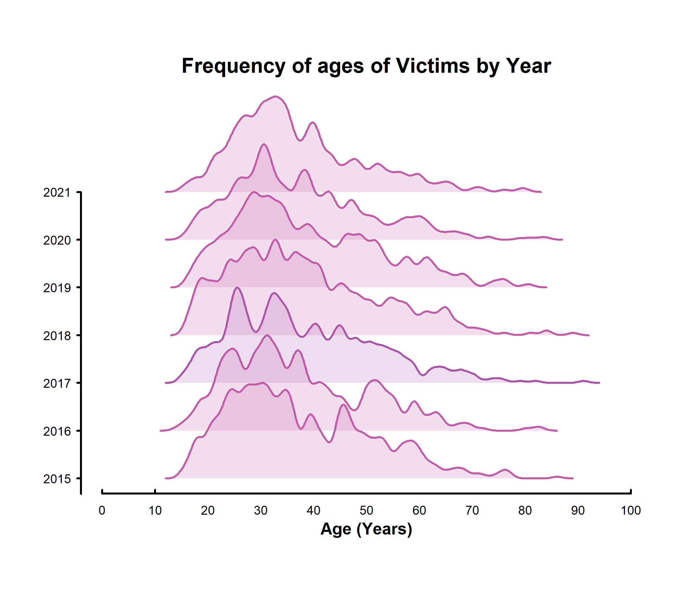

Investigating Fatal Police Encounters
================
Williem Encarnacion, Jerome Veix, Paula Palles, Zacharia Mwaura

``` r
#Sys.setenv(RSTUDIO_PANDOC="C:/Program Files/RStudio/bin/pandoc")
```

``` r
#install.packages("rapport")
#install.packages("RColorBrewer")
library(RColorBrewer)
#install.packages("GISTools")
#library(GISTools)
library(corrplot)
```

    ## corrplot 0.94 loaded

``` r
library(rapport)
library(mlogit)
```

    ## Loading required package: dfidx

    ## 
    ## Attaching package: 'dfidx'

    ## The following object is masked from 'package:stats':
    ## 
    ##     filter

``` r
#install.packages("maps")
#install.packages("maptools", repos = "https://packagemanager.posit.co/cran/2023-10-13")

#install.packages("sp")
library(maps)
library(maptools)
```

    ## Loading required package: sp

    ## Please note that 'maptools' will be retired during October 2023,
    ## plan transition at your earliest convenience (see
    ## https://r-spatial.org/r/2023/05/15/evolution4.html and earlier blogs
    ## for guidance);some functionality will be moved to 'sp'.
    ##  Checking rgeos availability: FALSE

    ## 
    ## Attaching package: 'maptools'

    ## The following object is masked from 'package:sp':
    ## 
    ##     sp2Mondrian

``` r
library(sp)
suppressMessages(library(car))


colours <- brewer.pal(8, "Pastel2")

coloursT <- adjustcolor( colours, alpha.f = 0.2)
```

## File

``` r
police <- read.csv("C:/Users/jamir/Downloads/fatal-police-shootings-data.csv")
policeData <- na.omit(police)
policeData1 <-policeData 
str(police)
```

    ## 'data.frame':    6953 obs. of  17 variables:
    ##  $ id                     : int  3 4 5 8 9 11 13 15 16 17 ...
    ##  $ name                   : chr  "Tim Elliot" "Lewis Lee Lembke" "John Paul Quintero" "Matthew Hoffman" ...
    ##  $ date                   : chr  "2015-01-02" "2015-01-02" "2015-01-03" "2015-01-04" ...
    ##  $ manner_of_death        : chr  "shot" "shot" "shot and Tasered" "shot" ...
    ##  $ armed                  : chr  "gun" "gun" "unarmed" "toy weapon" ...
    ##  $ age                    : int  53 47 23 32 39 18 22 35 34 47 ...
    ##  $ gender                 : chr  "M" "M" "M" "M" ...
    ##  $ race                   : chr  "A" "W" "H" "W" ...
    ##  $ city                   : chr  "Shelton" "Aloha" "Wichita" "San Francisco" ...
    ##  $ state                  : chr  "WA" "OR" "KS" "CA" ...
    ##  $ signs_of_mental_illness: chr  "True" "False" "False" "True" ...
    ##  $ threat_level           : chr  "attack" "attack" "other" "attack" ...
    ##  $ flee                   : chr  "Not fleeing" "Not fleeing" "Not fleeing" "Not fleeing" ...
    ##  $ body_camera            : chr  "False" "False" "False" "False" ...
    ##  $ longitude              : num  -123.1 -122.9 -97.3 -122.4 -104.7 ...
    ##  $ latitude               : num  47.2 45.5 37.7 37.8 40.4 ...
    ##  $ is_geocoding_exact     : chr  "True" "True" "True" "True" ...

``` r
str(policeData)
```

    ## 'data.frame':    6121 obs. of  17 variables:
    ##  $ id                     : int  3 4 5 8 9 11 13 15 16 17 ...
    ##  $ name                   : chr  "Tim Elliot" "Lewis Lee Lembke" "John Paul Quintero" "Matthew Hoffman" ...
    ##  $ date                   : chr  "2015-01-02" "2015-01-02" "2015-01-03" "2015-01-04" ...
    ##  $ manner_of_death        : chr  "shot" "shot" "shot and Tasered" "shot" ...
    ##  $ armed                  : chr  "gun" "gun" "unarmed" "toy weapon" ...
    ##  $ age                    : int  53 47 23 32 39 18 22 35 34 47 ...
    ##  $ gender                 : chr  "M" "M" "M" "M" ...
    ##  $ race                   : chr  "A" "W" "H" "W" ...
    ##  $ city                   : chr  "Shelton" "Aloha" "Wichita" "San Francisco" ...
    ##  $ state                  : chr  "WA" "OR" "KS" "CA" ...
    ##  $ signs_of_mental_illness: chr  "True" "False" "False" "True" ...
    ##  $ threat_level           : chr  "attack" "attack" "other" "attack" ...
    ##  $ flee                   : chr  "Not fleeing" "Not fleeing" "Not fleeing" "Not fleeing" ...
    ##  $ body_camera            : chr  "False" "False" "False" "False" ...
    ##  $ longitude              : num  -123.1 -122.9 -97.3 -122.4 -104.7 ...
    ##  $ latitude               : num  47.2 45.5 37.7 37.8 40.4 ...
    ##  $ is_geocoding_exact     : chr  "True" "True" "True" "True" ...
    ##  - attr(*, "na.action")= 'omit' Named int [1:832] 128 770 810 820 933 941 966 991 1338 1353 ...
    ##   ..- attr(*, "names")= chr [1:832] "128" "770" "810" "820" ...

## Graph of race and proportions

``` r
# policeData$threat_level <- factor(policeData$threat_level,
#                        levels = c("attack", "other","undetermined") ,
#                        labels = c(0,1,2))

prop <- NULL
races <- unique(policeData$race)
for (i in 1:length(races)){
  prop[i] <- sum(policeData$race == races[i])/length(policeData$race)

}
races
```

    ## [1] "A" "W" "H" "B" "O" ""  "N"

``` r
prop
```

    ## [1] 0.015683712 0.453520667 0.166312694 0.238359745 0.007515112 0.104884823
    ## [7] 0.013723248

``` r
#policeData$race <- factor(as.numeric(as.character(policeData$race,
                      #levels = c("A", "W", "H", "B", "O" ,"" , "N") ,
                      #labels = c(0,1,2,3,4,5,6))))

#as.numeric(as.character(policeData$race))

#"A" "W" "H" "B" "O" ""  "N"
#str(policeData)
#policeData


prop1 <- NULL
prop1 <- c(0.059 , 0.763, 0.185 ,0.134,  0 ,  0   , 0.013)
str(prop1)
```

    ##  num [1:7] 0.059 0.763 0.185 0.134 0 0 0.013

``` r
xPos1 <- barplot(prop, ylim=c(-0.8,0.8),axes=FALSE, col=colours,border=NA,beside=TRUE,space=c(0.35))
axis(2, at=pretty(c(-0.8,0.8)), tck=-.01,lwd=2,labels = FALSE )
mtext(pretty(c(-0.8,0.8)),2,at=pretty(c(-0.8,0.8)), las=1, line=.25)
mtext(c("Asian", "White", "Hispanic", "Black", "Other" ,"Missing" , "Native\nAmerican"),1, at=xPos1, line=.25, font=2,cex=1,padj =1)
mtext("Proportion of fatal police shootings",2,line =2.5, font =2, at=0.2,cex=1) 
mtext("A. Fatal Police Shootings and Race",3,line =.25, font =2,cex=1.25)

xPos2 <- barplot((-1*(prop1)), ylim=c(-0.8,0.8),axes=FALSE, col=coloursT,border=NA,beside=TRUE,space=c(0.35),add=TRUE)
```


``` r
#barplot(prop)
```

If you compare these ratios to the percentage based off census data:

Data Set:

"A" "W" "H" "B" "O" "" "N" 0.015683712 0.453520667 0.166312694 0.238359745 0.007515112 0.104884823 0.013723248

Census Data:

"A" "W" "H" "B" "O" "" "N" 0.059 0.763 0.185 0.134 NA NA 0.013

Black people are over represented in this data set as more percentage of them are shot and make up a higher popultion in the dataset than in real life. The dataset doesn't take into account that there are higher populations of white folks so that's why there is more discrepancies than what meets news coverage.

## Males Armed Race Threat Level Proportions

``` r
armeddatarefined <- policeData$armed != "unarmed" 
armeddata <- policeData[armeddatarefined,]
armeddatarefined1 <- armeddata$armed != ""
PoliceDataARMED <- armeddata[armeddatarefined1,]

#unique(PoliceDataARMED$race)


PoliceDataARMEDMale <- PoliceDataARMED$gender == "M"
PoliceDataARMEDM <- PoliceDataARMED[PoliceDataARMEDMale,]

#unique(PoliceDataARMEDM$race)

PoliceDataARMEDMaleThreat <- PoliceDataARMEDM$threat_level == "attack"
PoliceDataARMEDMT <- PoliceDataARMEDM[PoliceDataARMEDMaleThreat,]

unique(PoliceDataARMEDMT$race)
```

    ## [1] "A" "W" "H" "B" ""  "N" "O"

``` r
propMThreatArmedbyRace <- NULL
races1 <- unique(PoliceDataARMEDMT$race)
for (i in 1:length(races1)){
  propMThreatArmedbyRace[i] <- sum(PoliceDataARMEDMT$race == races1[i])/length(PoliceDataARMEDMT$race)

}
propMThreatArmedbyRace
```

    ## [1] 0.014152279 0.457967733 0.153976790 0.244268327 0.109538636 0.013020096
    ## [7] 0.007076139

``` r
xPos1 <- barplot(propMThreatArmedbyRace, ylim=c(-0.8,0.8),axes=FALSE, col=rgb(0,0,1,1/4),border=NA,beside=TRUE,space=c(0.35))
axis(2, at=pretty(c(-0.8,0.8)), tck=-.01,lwd=2,labels = FALSE )
mtext(pretty(c(-0.8,0.8)),2,at=pretty(c(-0.8,0.8)), las=1, line=.25)
mtext(c("Asian", "White", "Hispanic", "Black", "Other" ,"Missing" , "Native\nAmerican"),1, at=xPos1, line=.25, font=2,cex=1,padj =1)
mtext("Frequency",2,line =2, font =2, cex = 1.2, at = 0) 

mtext("A. Fatal Police Shootings, Race, Gender,\n and Armed Status",3,line =.00001, font =2,cex=1.2)

xPos2 <- barplot((-1*(prop1)), ylim=c(-0.8,0.8),axes=FALSE, col=rgb(1,0,0,1/4),border=NA,beside=TRUE,space=c(0.35),add=TRUE)

legend("bottomright", c("Proportion of fatal police shootings\n based on attack threat level", "Proportion of race\n based on census data"), fill = c(rgb(0,0,1,1/4),rgb(1,0,0,1/4)), bty = "n", border = NA)
```


This is also a good time to get the unique values from the months variable and create a Month label vector that you can then use to label your axes below. \#RUN THESE AFTER RERUNNING PoliceDataARMEDMT THAT IS LOCATED AT THE BEGINNING OF THE PROGRAM. MAKE SURE TO NOT RUN THE MAP PROGRAM THAT APPEAR AFTER THAT CODE BECUASE IT ALTERS THE PoliceDataARMEDMT COLUMN.

``` r
#RUN AFTER RERUNNING PoliceDataARMEDMT THAT IS LOCATED AT THE BEGINNING OF THE PROGRAM. MAKE SURE TO NOT RUN THE MAP PROGRAM THAT APPEAR AFTER THAT CODE BECUASE IT ALTERS THE PoliceDataARMEDMT COLUMN.


#that is located at the beginning of the program. Make sure do not run the map

years <- substr(policeData$date,1, 4)
uniqueYears <- unique(years)
YearLabels <- c("2015", "2016","2017","2018","2019",  "2020","2021")
```

``` r
yLimit <- range((1:((length(uniqueYears)/2)+2)))
#xLimit <- range(pretty(length(policeData$manner_of_death)))


sunsetColours <- hcl.colors(12,"Sunset")
```

``` r
plot(x = NULL, y = NULL, xlim = c(0,100), ylim = yLimit, axes = FALSE, ann = FALSE)

#abline(h=1.5,lty=2,lwd=2, ) # To create the line at the bottom of the graph that separates 2021 from 2022

# Write out the 2021 and 2022 in th chart. 
#text(120,1.75,"2021",cex=.75)  
#text(120,1.25,"2022",cex=.75)

# Draw out your 
for (i in 1:length(uniqueYears)){
  YearData <- policeData[years==uniqueYears[i], "age"]# Obtain month data for the current month (i)
  D <- density(YearData, bw=1)
  D$y <- ((D$y / max(D$y))+0.5) # Normalize the density values to range between 0 - 1 (makes plotting a lot easier)
  
  
  #Build an index to assign the correct color to current distribution
  ## I am pretty sure this involves max(D$y) for index I but I have spent 15 hours trying to do this one question so it is what is.
  

  highfreqtemp <- D$x[D$y==max(D$y)]

  
  colourIDX <- round(highfreqtemp*length(sunsetColours)/max(policeData$age))
  colourTIDX <- coloursT
  
  polygon(D$x,
          c(D$y +(i/2)), rep((i/2) - 0.5, D$y[1]),
          col = adjustcolor(sunsetColours[colourIDX], alpha.f = 0.2),
          border = NA)
    
  lines(D$x,
        (D$y +(i/2)),
        lwd = 2,
        col = sunsetColours[colourIDX])
  
  mtext(YearLabels[i],2,at=(D$y[i] +(i/2)),las=1,line=0.5, cex=.75)
  #lines() # Draw the distribution line
  #polygon() # Draw the distribution polygon

  
}

# Define your axis and labels (axis, mtext...)
axis(1,c(0,100,10), tck=.01,lwd=2, labels=FALSE)
axis(2,at=seq(0,4,0.5), lwd=2, tck=-.01, labels=FALSE)

mtext("Age (Years)", 1, font=2, line=1.25)
#mtext()
mtext(seq(0,100,10),1,at=seq(0,100,10), line=.25,cex=.75)
#mtext("A. Writing Test Scores:\nNo Test Prep",3,line =.25, font =2,cex=1.25)
mtext("Frequency of ages of Victims by Year",3,line=.25,font=2,cex=1.25)
```


<p class="caption">
Distribution of daily maximum temperatures (in degrees Fahrenheit) for the Newark, NJ, area from March 2021 to February 2022. Distributions are color coded according to their month.
</p>

``` r
#PoliceDataARMEDMT
```

## POLICE ARMED THREAT MALE

``` r
years1 <- substr(PoliceDataARMEDMT$date,1, 4)
uniqueYears1 <- unique(years1)
YearLabels1 <- c("2015", "2016","2017","2018","2019",  "2020","2021")
```

``` r
yLimit1 <- range((1:((length(uniqueYears)/2)+2)))
#xLimit <- range(pretty(length(policeData$manner_of_death)))


sunsetColours <- hcl.colors(12,"Sunset")
```

``` r
#ONCE AGAIN, MAKE SURE YOU RUN THIS AFTER RERUNNING PoliceDataARMEDMT THAT IS LOCATED AT THE BEGINNING OF THE PROGRAM. MAKE SURE TO NOT RUN THE MAP PROGRAM THAT APPEAR AFTER THAT CODE BECUASE IT ALTERS THE PoliceDataARMEDMT COLUMN.

plot(x = NULL, y = NULL, xlim = c(0,100), ylim = yLimit1, axes = FALSE, ann = FALSE)

#abline(h=1.5,lty=2,lwd=2, ) # To create the line at the bottom of the graph that separates 2021 from 2022

# Write out the 2021 and 2022 in th chart. 
#text(120,1.75,"2021",cex=.75)  
#text(120,1.25,"2022",cex=.75)

# Draw out your 
for (i in 1:length(uniqueYears1)){
  YearData1 <- PoliceDataARMEDMT[years1==uniqueYears1[i], "age"]# Obtain month data for the current month (i)
  D1 <- density(YearData1, bw=1)
  D1$y <- ((D1$y / max(D1$y))+0.5) # Normalize the density values to range between 0 - 1 (makes plotting a lot easier)
  
  
  #Build an index to assign the correct color to current distribution
  ## I am pretty sure this involves max(D$y) for index I but I have spent 15 hours trying to do this one question so it is what is.
  

  highfreqtemp1 <- D1$x[D1$y==max(D1$y)]

  
  colourIDX1 <- round(highfreqtemp1*length(sunsetColours)/max(PoliceDataARMEDMT$age))
  colourTIDX1 <- coloursT
  
  polygon(D1$x,
          c(D1$y +(i/2)), rep((i/2) - 0.5, D1$y[1]),
          col = adjustcolor(sunsetColours[colourIDX1], alpha.f = 0.2),
          border = NA)
    
  lines(D1$x,
        (D1$y +(i/2)),
        lwd = 2,
        col = sunsetColours[colourIDX1])
  
  mtext(YearLabels1[i],2,at=(D$y[i] +(i/2)),las=1,line=0.5, cex=.75)
  #lines() # Draw the distribution line
  #polygon() # Draw the distribution polygon

  
}

# Define your axis and labels (axis, mtext...)
axis(1,c(0,100,10), tck=.01,lwd=2, labels=FALSE)
axis(2,at=seq(0,4,0.5), lwd=2, tck=-.01, labels=FALSE)

mtext("Age (Years)", 1, font=2, line=1.25)
#mtext()
mtext(seq(0,100,10),1,at=seq(0,100,10), line=.25,cex=.75)
#mtext("A. Writing Test Scores:\nNo Test Prep",3,line =.25, font =2,cex=1.25)
mtext("Frequency of ages of Victims by Year",3,line=.25,font=2,cex=1.25)
```


<p class="caption">
Distribution of daily maximum temperatures (in degrees Fahrenheit) for the Newark, NJ, area from March 2021 to February 2022. Distributions are color coded according to their month.
</p>

## COMBINED GRAPHS

## Green is Whole Data Set and Purple is the Threat Level Armed Males Subset

``` r
sunsetColours1 <- hcl.colors(15,"Peach")

plot(x = NULL, y = NULL, xlim = c(0,100), ylim = yLimit1, axes = FALSE, ann = FALSE)

#abline(h=1.5,lty=2,lwd=2, ) # To create the line at the bottom of the graph that separates 2021 from 2022

# Write out the 2021 and 2022 in th chart. 
#text(120,1.75,"2021",cex=.75)  
#text(120,1.25,"2022",cex=.75)

# Draw out your 
for (i in 1:length(uniqueYears1)){
  YearData1 <- PoliceDataARMEDMT[years1==uniqueYears1[i], "age"]# Obtain month data for the current month (i)
  D1 <- density(YearData1, bw=1)
  D1$y <- ((D1$y / max(D1$y))+0.5) # Normalize the density values to range between 0 - 1 (makes plotting a lot easier)
  
  
  #Build an index to assign the correct color to current distribution
  ## I am pretty sure this involves max(D$y) for index I but I have spent 15 hours trying to do this one question so it is what is.
  

  highfreqtemp1 <- D1$x[D1$y==max(D1$y)]

  
  colourIDX1 <- round(highfreqtemp1*length(sunsetColours)/max(PoliceDataARMEDMT$age))
  colourTIDX1 <- coloursT
  
  polygon(D1$x,
          c(D1$y +(i/2)), rep((i/2) - 0.5, D1$y[1]),
          col = adjustcolor(sunsetColours[colourIDX1], alpha.f = 0.2),
          border = NA)
    
  lines(D1$x,
        (D1$y +(i/2)),
        lwd = 2,
        col = sunsetColours[colourIDX1])
  
  mtext(YearLabels1[i],2,at=(D$y[i] +(i/2)),las=1,line=0.5, cex=.75)
  #lines() # Draw the distribution line
  #polygon() # Draw the distribution polygon

  
}

# Define your axis and labels (axis, mtext...)
axis(1,c(0,100,10), tck=.01,lwd=2, labels=FALSE)
axis(2,at=seq(0,4,0.5), lwd=2, tck=-.01, labels=FALSE)

mtext("Age (Years)", 1, font=2, line=1.25)
#mtext()
mtext(seq(0,100,10),1,at=seq(0,100,10), line=.25,cex=.75)
#mtext("A. Writing Test Scores:\nNo Test Prep",3,line =.25, font =2,cex=1.25)
mtext("Frequency of ages of Victims by Year",3,line=.25,font=2,cex=1.25)


# Draw out your 
for (i in 1:length(uniqueYears)){
  YearData <- policeData[years==uniqueYears[i], "age"]# Obtain month data for the current month (i)
  D <- density(YearData, bw=1)
  D$y <- ((D$y / max(D$y))+0.5) # Normalize the density values to range between 0 - 1 (makes plotting a lot easier)
  
  
  #Build an index to assign the correct color to current distribution
  ## I am pretty sure this involves max(D$y) for index I but I have spent 15 hours trying to do this one question so it is what is.
  
colors <- brewer.pal(12,"Paired")

  highfreqtemp <- D$x[D$y==max(D$y)]

  
  colourIDX <- round(highfreqtemp*length(colors)/max(policeData$age))
 
  
  polygon(D$x,
          c(D$y +(i/2)), rep((i/2) - 0.5, D$y[1]),
          col = adjustcolor(colors[colourIDX], alpha.f = 0.2),
          border = NA)
    
  #colors[colourIDX])
  lines(D$x,
        (D$y +(i/2)),
        lwd = 2,
        col = colors[colourIDX])
  
  mtext(YearLabels[i],2,at=(D$y[i] +(i/2)),las=1,line=0.5, cex=.75)
  #lines() # Draw the distribution line
  #polygon() # Draw the distribution polygon

   
}

legend("topright", c("Green = Actual data", "Purple = Subset"), bty = "n", border = NA)
```


<p class="caption">
Distribution of daily maximum temperatures (in degrees Fahrenheit) for the Newark, NJ, area from March 2021 to February 2022. Distributions are color coded according to their month.
</p>

### Creating a heatmap

``` r
#Relabel them as numerical variables using the or functions
genderRelabel <- factor(policeData$gender, c("F","M"), c(0, 1))    # F is 0, M is 1
mannerDRelabel <- factor(policeData$manner_of_death, c("shot","shot and Tasered"), c(0, 1))

policeData$gender <- as.integer(as.character(genderRelabel))[genderRelabel]    
policeData$manner_of_death <- as.integer(as.character(mannerDRelabel))[mannerDRelabel]    

#Organize your data and calculate the appropriate frequencies (number of observations by group)

#create a matrix for males and females that have risk of CHD
IDXfemale <- policeData$gender == "0"                #filtering though for only women
policeData.Female <- policeData[IDXfemale,]          #assigning all the female values to new subset
policeData.Female                                 #print new subset
```

    ##    id name date manner_of_death armed age gender race city state
    ## NA NA <NA> <NA>              NA  <NA>  NA     NA <NA> <NA>  <NA>
    ##    signs_of_mental_illness threat_level flee body_camera longitude latitude
    ## NA                    <NA>         <NA> <NA>        <NA>        NA       NA
    ##    is_geocoding_exact
    ## NA               <NA>

``` r
IDXmale <- policeData$gender == "1" 
policeData.Male <- policeData[IDXmale,]           #filtering though chdData for only men by ! the women
#policeData.Male                                   #print
```

``` r
propGender <- NULL
propGender <- matrix(, nrow =1, ncol = 2)        #making a matrix of 1 row and 2 columns
colnames(propGender) <- c('Males', 'Females')    #naming the matrix columns to be M & F
#rownames(propSex) <- "CHD"                    #naming the matrix row to stand for Coronary Heart Disease
propGender[1,1] <-  sum(policeData.Male$manner_of_death)/ length(policeData.Male$manner_of_death)
propGender[1,2] <-  sum(policeData.Female$manner_of_death)/ length(policeData.Female$manner_of_death)
propGender
```

    ##      Males Females
    ## [1,]    NA      NA

``` r
armeddatarefined <- policeData$armed != "unarmed" 
armeddata <- policeData[armeddatarefined,]
armeddatarefined1 <- armeddata$armed != ""
PoliceDataARMED <- armeddata[armeddatarefined1,]

#unique(PoliceDataARMED$race)


PoliceDataARMEDMale <- PoliceDataARMED$gender == "M"
PoliceDataARMEDM <- PoliceDataARMED[PoliceDataARMEDMale,]

#unique(PoliceDataARMEDM$race)

PoliceDataARMEDMaleThreat <- PoliceDataARMEDM$threat_level == "attack"
PoliceDataARMEDMT <- PoliceDataARMEDM[PoliceDataARMEDMaleThreat,]

#PoliceDataARMED
```

``` r
unique(PoliceDataARMED$date)
```

    ##    [1] "2015-01-02" "2015-01-04" "2015-01-05" "2015-01-06" "2015-01-07"
    ##    [6] "2015-01-08" "2015-01-09" "2015-01-11" "2015-01-13" "2015-01-14"
    ##   [11] "2015-01-15" "2015-01-16" "2015-01-17" "2015-01-18" "2015-01-19"
    ##   [16] "2015-01-21" "2015-01-22" "2015-01-23" "2015-01-24" "2015-01-25"
    ##   [21] "2015-01-26" "2015-01-27" "2015-01-28" "2015-01-29" "2015-01-30"
    ##   [26] "2015-01-31" "2015-02-02" "2015-02-03" "2015-02-04" "2015-02-05"
    ##   [31] "2015-02-06" "2015-02-07" "2015-02-08" "2015-02-09" "2015-02-10"
    ##   [36] "2015-02-11" "2015-02-13" "2015-02-14" "2015-02-15" "2015-02-16"
    ##   [41] "2015-02-17" "2015-02-18" "2015-02-20" "2015-02-21" "2015-02-22"
    ##   [46] "2015-02-23" "2015-02-24" "2015-02-25" "2015-02-26" "2015-02-28"
    ##   [51] "2015-03-01" "2015-03-02" "2015-03-03" "2015-03-04" "2015-03-05"
    ##   [56] "2015-03-07" "2015-03-08" "2015-03-09" "2015-03-10" "2015-03-11"
    ##   [61] "2015-03-13" "2015-03-14" "2015-03-15" "2015-03-16" "2015-03-17"
    ##   [66] "2015-03-18" "2015-03-19" "2015-03-20" "2015-03-21" "2015-03-22"
    ##   [71] "2015-03-23" "2015-03-24" "2015-03-25" "2015-03-26" "2015-03-27"
    ##   [76] "2015-03-29" "2015-03-30" "2015-03-31" "2015-04-01" "2015-04-02"
    ##   [81] "2015-04-03" "2015-04-04" "2015-04-05" "2015-04-06" "2015-04-07"
    ##   [86] "2015-04-08" "2015-04-09" "2015-04-10" "2015-04-11" "2015-04-12"
    ##   [91] "2015-04-13" "2015-04-14" "2015-04-15" "2015-04-16" "2015-04-17"
    ##   [96] "2015-04-18" "2015-04-19" "2015-04-20" "2015-04-21" "2015-04-22"
    ##  [101] "2015-04-23" "2015-04-24" "2015-04-25" "2015-04-26" "2015-04-27"
    ##  [106] "2015-04-28" "2015-04-29" "2015-04-30" "2015-05-02" "2015-05-03"
    ##  [111] "2015-05-04" "2015-05-05" "2015-05-06" "2015-05-07" "2015-05-08"
    ##  [116] "2015-05-10" "2015-05-11" "2015-05-12" "2015-05-14" "2015-05-15"
    ##  [121] "2015-05-16" "2015-05-17" "2015-05-19" "2015-05-20" "2015-05-21"
    ##  [126] "2015-05-22" "2015-05-23" "2015-05-25" "2015-05-26" "2015-05-27"
    ##  [131] "2015-05-28" "2015-05-29" "2015-05-30" "2015-05-31" "2015-06-01"
    ##  [136] "2015-06-02" "2015-06-03" "2015-06-05" "2015-06-06" "2015-06-07"
    ##  [141] "2015-06-08" "2015-06-09" "2015-06-10" "2015-06-11" "2015-06-12"
    ##  [146] "2015-06-13" "2015-06-14" "2015-06-16" "2015-06-17" "2015-06-18"
    ##  [151] "2015-06-19" "2015-06-20" "2015-06-21" "2015-06-22" "2015-06-23"
    ##  [156] "2015-06-24" "2015-06-25" "2015-06-26" "2015-06-27" "2015-06-28"
    ##  [161] "2015-06-29" "2015-06-30" "2015-07-01" "2015-07-02" "2015-07-03"
    ##  [166] "2015-07-04" "2015-07-05" "2015-07-06" "2015-07-07" "2015-07-08"
    ##  [171] "2015-07-09" "2015-07-10" "2015-07-11" "2015-07-12" "2015-07-13"
    ##  [176] "2015-07-14" "2015-07-15" "2015-07-16" "2015-07-17" "2015-07-18"
    ##  [181] "2015-07-20" "2015-07-21" "2015-07-22" "2015-07-23" "2015-07-24"
    ##  [186] "2015-07-25" "2015-07-26" "2015-07-27" "2015-07-28" "2015-07-29"
    ##  [191] "2015-07-30" "2015-07-31" "2015-08-01" "2015-08-03" "2015-08-04"
    ##  [196] "2015-08-05" "2015-08-06" "2015-08-07" "2015-08-08" "2015-08-09"
    ##  [201] "2015-08-11" "2015-08-12" "2015-08-14" "2015-08-15" "2015-08-16"
    ##  [206] "2015-08-17" "2015-08-19" "2015-08-20" "2015-08-21" "2015-08-22"
    ##  [211] "2015-08-23" "2015-08-25" "2015-08-26" "2015-08-27" "2015-08-28"
    ##  [216] "2015-08-29" "2015-08-30" "2015-08-31" "2015-09-01" "2015-09-02"
    ##  [221] "2015-09-04" "2015-09-05" "2015-09-06" "2015-09-07" "2015-09-08"
    ##  [226] "2015-09-09" "2015-09-10" "2015-09-11" "2015-09-12" "2015-09-13"
    ##  [231] "2015-09-14" "2015-09-15" "2015-09-16" "2015-09-17" "2015-09-18"
    ##  [236] "2015-09-19" "2015-09-20" "2015-09-21" "2015-09-22" "2015-09-23"
    ##  [241] "2015-09-24" "2015-09-25" "2015-09-26" "2015-09-27" "2015-09-28"
    ##  [246] "2015-09-29" "2015-09-30" "2015-10-02" "2015-10-04" "2015-10-05"
    ##  [251] "2015-10-06" "2015-10-07" "2015-10-09" "2015-10-10" "2015-10-11"
    ##  [256] "2015-10-12" "2015-10-14" "2015-10-15" "2015-10-16" "2015-10-17"
    ##  [261] "2015-10-18" "2015-10-20" "2015-10-21" "2015-10-22" "2015-10-24"
    ##  [266] "2015-10-25" "2015-10-26" "2015-10-27" "2015-10-28" "2015-10-29"
    ##  [271] "2015-10-30" "2015-10-31" "2015-11-01" "2015-11-02" "2015-11-04"
    ##  [276] "2015-11-05" "2015-11-06" "2015-11-09" "2015-11-10" "2015-11-11"
    ##  [281] "2015-11-12" "2015-11-13" "2015-11-14" "2015-11-15" "2015-11-17"
    ##  [286] "2015-11-18" "2015-11-19" "2015-11-20" "2015-11-22" "2015-11-23"
    ##  [291] "2015-11-24" "2015-11-25" "2015-11-27" "2015-11-28" "2015-11-29"
    ##  [296] "2015-11-30" "2015-12-01" "2015-12-02" "2015-12-03" "2015-12-04"
    ##  [301] "2015-12-05" "2015-12-06" "2015-12-08" "2015-12-09" "2015-12-10"
    ##  [306] "2015-12-12" "2015-12-13" "2015-12-14" "2015-12-16" "2015-12-17"
    ##  [311] "2015-12-18" "2015-12-19" "2015-12-20" "2015-12-21" "2015-12-22"
    ##  [316] "2015-12-24" "2015-12-25" "2015-12-26" "2015-12-27" "2015-12-28"
    ##  [321] "2015-12-29" "2015-12-30" "2016-01-01" "2016-01-02" "2016-01-03"
    ##  [326] "2016-01-04" "2016-01-05" "2016-01-06" "2016-01-08" "2016-01-10"
    ##  [331] "2016-01-11" "2016-01-12" "2016-01-13" "2016-01-14" "2016-01-15"
    ##  [336] "2016-01-16" "2016-01-17" "2016-01-18" "2016-01-19" "2016-01-20"
    ##  [341] "2016-01-21" "2016-01-23" "2016-01-25" "2016-01-26" "2016-01-27"
    ##  [346] "2016-01-28" "2016-01-29" "2016-01-30" "2016-01-31" "2016-02-01"
    ##  [351] "2016-02-02" "2016-02-03" "2016-02-04" "2016-02-05" "2016-02-06"
    ##  [356] "2016-02-07" "2016-02-08" "2016-02-09" "2016-02-10" "2016-02-11"
    ##  [361] "2016-02-12" "2016-02-13" "2016-02-14" "2016-02-15" "2016-02-16"
    ##  [366] "2016-02-17" "2016-02-18" "2016-02-19" "2016-02-20" "2016-02-21"
    ##  [371] "2016-02-22" "2016-02-23" "2016-02-24" "2016-02-25" "2016-02-26"
    ##  [376] "2016-02-27" "2016-02-28" "2016-02-29" "2016-03-01" "2016-03-02"
    ##  [381] "2016-03-03" "2016-03-04" "2016-03-05" "2016-03-06" "2016-03-07"
    ##  [386] "2016-03-08" "2016-03-10" "2016-03-11" "2016-03-12" "2016-03-13"
    ##  [391] "2016-03-14" "2016-03-15" "2016-03-16" "2016-03-17" "2016-03-18"
    ##  [396] "2016-03-19" "2016-03-20" "2016-03-21" "2016-03-22" "2016-03-23"
    ##  [401] "2016-03-24" "2016-03-26" "2016-03-27" "2016-03-29" "2016-03-30"
    ##  [406] "2016-03-31" "2016-04-01" "2016-04-02" "2016-04-03" "2016-04-04"
    ##  [411] "2016-04-05" "2016-04-06" "2016-04-07" "2016-04-08" "2016-04-09"
    ##  [416] "2016-04-10" "2016-04-11" "2016-04-12" "2016-04-13" "2016-04-15"
    ##  [421] "2016-04-16" "2016-04-17" "2016-04-18" "2016-04-19" "2016-04-20"
    ##  [426] "2016-04-21" "2016-04-22" "2016-04-23" "2016-04-25" "2016-04-26"
    ##  [431] "2016-04-27" "2016-04-28" "2016-04-30" "2016-05-01" "2016-05-02"
    ##  [436] "2016-05-03" "2016-05-04" "2016-05-05" "2016-05-07" "2016-05-08"
    ##  [441] "2016-05-09" "2016-05-10" "2016-05-11" "2016-05-13" "2016-05-14"
    ##  [446] "2016-05-15" "2016-05-16" "2016-05-17" "2016-05-18" "2016-05-19"
    ##  [451] "2016-05-20" "2016-05-22" "2016-05-23" "2016-05-24" "2016-05-25"
    ##  [456] "2016-05-26" "2016-05-27" "2016-05-28" "2016-05-29" "2016-05-30"
    ##  [461] "2016-05-31" "2016-06-01" "2016-06-02" "2016-06-03" "2016-06-04"
    ##  [466] "2016-06-05" "2016-06-06" "2016-06-07" "2016-06-08" "2016-06-09"
    ##  [471] "2016-06-10" "2016-06-11" "2016-06-12" "2016-06-13" "2016-06-14"
    ##  [476] "2016-06-16" "2016-06-18" "2016-06-19" "2016-06-20" "2016-06-21"
    ##  [481] "2016-06-22" "2016-06-23" "2016-06-24" "2016-06-25" "2016-06-26"
    ##  [486] "2016-06-27" "2016-06-28" "2016-06-29" "2016-06-30" "2016-07-01"
    ##  [491] "2016-07-02" "2016-07-03" "2016-07-04" "2016-07-05" "2016-07-06"
    ##  [496] "2016-07-07" "2016-07-08" "2016-07-09" "2016-07-10" "2016-07-11"
    ##  [501] "2016-07-12" "2016-07-13" "2016-07-14" "2016-07-15" "2016-07-16"
    ##  [506] "2016-07-17" "2016-07-18" "2016-07-20" "2016-07-21" "2016-07-23"
    ##  [511] "2016-07-24" "2016-07-25" "2016-07-26" "2016-07-27" "2016-07-28"
    ##  [516] "2016-07-29" "2016-07-31" "2016-08-01" "2016-08-02" "2016-08-03"
    ##  [521] "2016-08-05" "2016-08-07" "2016-08-08" "2016-08-09" "2016-08-11"
    ##  [526] "2016-08-12" "2016-08-13" "2016-08-15" "2016-08-16" "2016-08-17"
    ##  [531] "2016-08-18" "2016-08-19" "2016-08-20" "2016-08-21" "2016-08-22"
    ##  [536] "2016-08-23" "2016-08-24" "2016-08-25" "2016-08-26" "2016-08-27"
    ##  [541] "2016-08-28" "2016-08-29" "2016-08-30" "2016-08-31" "2016-09-01"
    ##  [546] "2016-09-02" "2016-09-03" "2016-09-04" "2016-09-05" "2016-09-06"
    ##  [551] "2016-09-07" "2016-09-08" "2016-09-09" "2016-09-10" "2016-09-11"
    ##  [556] "2016-09-12" "2016-09-14" "2016-09-15" "2016-09-16" "2016-09-17"
    ##  [561] "2016-09-18" "2016-09-19" "2016-09-20" "2016-09-23" "2016-09-25"
    ##  [566] "2016-09-26" "2016-09-28" "2016-09-29" "2016-09-30" "2016-10-01"
    ##  [571] "2016-10-02" "2016-10-03" "2016-10-04" "2016-10-05" "2016-10-07"
    ##  [576] "2016-10-08" "2016-10-09" "2016-10-10" "2016-10-11" "2016-10-12"
    ##  [581] "2016-10-13" "2016-10-14" "2016-10-15" "2016-10-16" "2016-10-17"
    ##  [586] "2016-10-18" "2016-10-19" "2016-10-20" "2016-10-21" "2016-10-22"
    ##  [591] "2016-10-23" "2016-10-24" "2016-10-25" "2016-10-26" "2016-10-27"
    ##  [596] "2016-10-28" "2016-10-30" "2016-10-31" "2016-11-01" "2016-11-02"
    ##  [601] "2016-11-03" "2016-11-05" "2016-11-06" "2016-11-07" "2016-11-08"
    ##  [606] "2016-11-09" "2016-11-10" "2016-11-11" "2016-11-12" "2016-11-13"
    ##  [611] "2016-11-15" "2016-11-16" "2016-11-18" "2016-11-19" "2016-11-20"
    ##  [616] "2016-11-21" "2016-11-22" "2016-11-23" "2016-11-24" "2016-11-25"
    ##  [621] "2016-11-27" "2016-11-28" "2016-11-29" "2016-11-30" "2016-12-01"
    ##  [626] "2016-12-02" "2016-12-03" "2016-12-04" "2016-12-06" "2016-12-07"
    ##  [631] "2016-12-09" "2016-12-10" "2016-12-11" "2016-12-12" "2016-12-13"
    ##  [636] "2016-12-15" "2016-12-17" "2016-12-18" "2016-12-19" "2016-12-20"
    ##  [641] "2016-12-21" "2016-12-22" "2016-12-23" "2016-12-24" "2016-12-25"
    ##  [646] "2016-12-27" "2016-12-28" "2016-12-29" "2016-12-30" "2016-12-31"
    ##  [651] "2017-01-01" "2017-01-03" "2017-01-04" "2017-01-05" "2017-01-06"
    ##  [656] "2017-01-07" "2017-01-08" "2017-01-09" "2017-01-10" "2017-01-11"
    ##  [661] "2017-01-12" "2017-01-14" "2017-01-15" "2017-01-16" "2017-01-17"
    ##  [666] "2017-01-18" "2017-01-19" "2017-01-20" "2017-01-21" "2017-01-22"
    ##  [671] "2017-01-23" "2017-01-24" "2017-01-25" "2017-01-26" "2017-01-27"
    ##  [676] "2017-01-28" "2017-01-29" "2017-01-30" "2017-02-02" "2017-02-03"
    ##  [681] "2017-02-04" "2017-02-05" "2017-02-06" "2017-02-07" "2017-02-08"
    ##  [686] "2017-02-09" "2017-02-10" "2017-02-11" "2017-02-12" "2017-02-13"
    ##  [691] "2017-02-14" "2017-02-15" "2017-02-16" "2017-02-17" "2017-02-18"
    ##  [696] "2017-02-19" "2017-02-20" "2017-02-21" "2017-02-22" "2017-02-23"
    ##  [701] "2017-02-24" "2017-02-25" "2017-02-26" "2017-02-27" "2017-02-28"
    ##  [706] "2017-03-01" "2017-03-02" "2017-03-03" "2017-03-04" "2017-03-07"
    ##  [711] "2017-03-08" "2017-03-09" "2017-03-10" "2017-03-11" "2017-03-12"
    ##  [716] "2017-03-13" "2017-03-14" "2017-03-15" "2017-03-16" "2017-03-17"
    ##  [721] "2017-03-18" "2017-03-19" "2017-03-22" "2017-03-23" "2017-03-24"
    ##  [726] "2017-03-25" "2017-03-26" "2017-03-27" "2017-03-28" "2017-03-29"
    ##  [731] "2017-04-01" "2017-04-03" "2017-04-04" "2017-04-05" "2017-04-06"
    ##  [736] "2017-04-07" "2017-04-08" "2017-04-09" "2017-04-10" "2017-04-12"
    ##  [741] "2017-04-13" "2017-04-14" "2017-04-15" "2017-04-16" "2017-04-19"
    ##  [746] "2017-04-20" "2017-04-21" "2017-04-22" "2017-04-23" "2017-04-24"
    ##  [751] "2017-04-25" "2017-04-26" "2017-04-27" "2017-04-28" "2017-04-29"
    ##  [756] "2017-04-30" "2017-05-01" "2017-05-02" "2017-05-03" "2017-05-04"
    ##  [761] "2017-05-06" "2017-05-07" "2017-05-08" "2017-05-09" "2017-05-10"
    ##  [766] "2017-05-12" "2017-05-13" "2017-05-14" "2017-05-15" "2017-05-16"
    ##  [771] "2017-05-20" "2017-05-21" "2017-05-22" "2017-05-23" "2017-05-26"
    ##  [776] "2017-05-27" "2017-05-28" "2017-05-29" "2017-05-31" "2017-06-01"
    ##  [781] "2017-06-02" "2017-06-03" "2017-06-04" "2017-06-05" "2017-06-06"
    ##  [786] "2017-06-07" "2017-06-08" "2017-06-09" "2017-06-10" "2017-06-12"
    ##  [791] "2017-06-13" "2017-06-14" "2017-06-15" "2017-06-16" "2017-06-17"
    ##  [796] "2017-06-18" "2017-06-19" "2017-06-20" "2017-06-21" "2017-06-23"
    ##  [801] "2017-06-24" "2017-06-25" "2017-06-26" "2017-06-27" "2017-06-28"
    ##  [806] "2017-06-29" "2017-06-30" "2017-07-01" "2017-07-02" "2017-07-03"
    ##  [811] "2017-07-04" "2017-07-05" "2017-07-06" "2017-07-07" "2017-07-08"
    ##  [816] "2017-07-09" "2017-07-11" "2017-07-12" "2017-07-13" "2017-07-15"
    ##  [821] "2017-07-17" "2017-07-18" "2017-07-19" "2017-07-20" "2017-07-21"
    ##  [826] "2017-07-23" "2017-07-24" "2017-07-25" "2017-07-26" "2017-07-27"
    ##  [831] "2017-07-28" "2017-07-29" "2017-07-31" "2017-08-01" "2017-08-02"
    ##  [836] "2017-08-03" "2017-08-04" "2017-08-05" "2017-08-06" "2017-08-07"
    ##  [841] "2017-08-08" "2017-08-10" "2017-08-11" "2017-08-12" "2017-08-13"
    ##  [846] "2017-08-14" "2017-08-15" "2017-08-16" "2017-08-17" "2017-08-18"
    ##  [851] "2017-08-19" "2017-08-20" "2017-08-21" "2017-08-22" "2017-08-23"
    ##  [856] "2017-08-24" "2017-08-25" "2017-08-26" "2017-08-27" "2017-08-28"
    ##  [861] "2017-08-29" "2017-08-30" "2017-08-31" "2017-09-01" "2017-09-03"
    ##  [866] "2017-09-04" "2017-09-05" "2017-09-06" "2017-09-07" "2017-09-08"
    ##  [871] "2017-09-09" "2017-09-10" "2017-09-11" "2017-09-13" "2017-09-15"
    ##  [876] "2017-09-17" "2017-09-18" "2017-09-19" "2017-09-20" "2017-09-21"
    ##  [881] "2017-09-22" "2017-09-24" "2017-09-25" "2017-09-26" "2017-09-27"
    ##  [886] "2017-09-28" "2017-09-30" "2017-10-01" "2017-10-02" "2017-10-03"
    ##  [891] "2017-10-04" "2017-10-05" "2017-10-06" "2017-10-07" "2017-10-08"
    ##  [896] "2017-10-10" "2017-10-11" "2017-10-12" "2017-10-13" "2017-10-14"
    ##  [901] "2017-10-16" "2017-10-18" "2017-10-19" "2017-10-20" "2017-10-21"
    ##  [906] "2017-10-22" "2017-10-23" "2017-10-24" "2017-10-25" "2017-10-26"
    ##  [911] "2017-10-27" "2017-10-28" "2017-10-29" "2017-10-30" "2017-10-31"
    ##  [916] "2017-11-01" "2017-11-02" "2017-11-03" "2017-11-04" "2017-11-05"
    ##  [921] "2017-11-06" "2017-11-07" "2017-11-08" "2017-11-09" "2017-11-10"
    ##  [926] "2017-11-11" "2017-11-13" "2017-11-14" "2017-11-15" "2017-11-16"
    ##  [931] "2017-11-17" "2017-11-18" "2017-11-19" "2017-11-20" "2017-11-23"
    ##  [936] "2017-11-24" "2017-11-25" "2017-11-26" "2017-11-27" "2017-11-28"
    ##  [941] "2017-11-29" "2017-11-30" "2017-12-01" "2017-12-02" "2017-12-03"
    ##  [946] "2017-12-04" "2017-12-05" "2017-12-06" "2017-12-07" "2017-12-08"
    ##  [951] "2017-12-09" "2017-12-10" "2017-12-11" "2017-12-12" "2017-12-15"
    ##  [956] "2017-12-17" "2017-12-18" "2017-12-19" "2017-12-20" "2017-12-21"
    ##  [961] "2017-12-22" "2017-12-23" "2017-12-24" "2017-12-25" "2017-12-26"
    ##  [966] "2017-12-27" "2017-12-28" "2017-12-29" "2017-12-30" "2017-12-31"
    ##  [971] "2018-01-01" "2018-01-02" "2018-01-03" "2018-01-04" "2018-01-05"
    ##  [976] "2018-01-06" "2018-01-07" "2018-01-08" "2018-01-09" "2018-01-10"
    ##  [981] "2018-01-11" "2018-01-12" "2018-01-13" "2018-01-14" "2018-01-15"
    ##  [986] "2018-01-16" "2018-01-17" "2018-01-18" "2018-01-19" "2018-01-20"
    ##  [991] "2018-01-21" "2018-01-22" "2018-01-23" "2018-01-24" "2018-01-25"
    ##  [996] "2018-01-26" "2018-01-27" "2018-01-28" "2018-01-29" "2018-01-31"
    ## [1001] "2018-02-01" "2018-02-02" "2018-02-03" "2018-02-04" "2018-02-05"
    ## [1006] "2018-02-06" "2018-02-08" "2018-02-09" "2018-02-10" "2018-02-11"
    ## [1011] "2018-02-12" "2018-02-13" "2018-02-14" "2018-02-15" "2018-02-16"
    ## [1016] "2018-02-17" "2018-02-18" "2018-02-19" "2018-02-21" "2018-02-22"
    ## [1021] "2018-02-23" "2018-02-25" "2018-02-26" "2018-02-27" "2018-02-28"
    ## [1026] "2018-03-01" "2018-03-02" "2018-03-03" "2018-03-05" "2018-03-06"
    ## [1031] "2018-03-07" "2018-03-08" "2018-03-09" "2018-03-10" "2018-03-11"
    ## [1036] "2018-03-12" "2018-03-13" "2018-03-16" "2018-03-17" "2018-03-18"
    ## [1041] "2018-03-19" "2018-03-20" "2018-03-21" "2018-03-22" "2018-03-23"
    ## [1046] "2018-03-24" "2018-03-25" "2018-03-27" "2018-03-28" "2018-03-29"
    ## [1051] "2018-03-30" "2018-03-31" "2018-04-01" "2018-04-03" "2018-04-04"
    ## [1056] "2018-04-05" "2018-04-06" "2018-04-07" "2018-04-08" "2018-04-09"
    ## [1061] "2018-04-10" "2018-04-11" "2018-04-12" "2018-04-13" "2018-04-14"
    ## [1066] "2018-04-15" "2018-04-17" "2018-04-18" "2018-04-20" "2018-04-21"
    ## [1071] "2018-04-22" "2018-04-24" "2018-04-25" "2018-04-26" "2018-04-28"
    ## [1076] "2018-04-29" "2018-04-30" "2018-05-01" "2018-05-02" "2018-05-03"
    ## [1081] "2018-05-04" "2018-05-05" "2018-05-06" "2018-05-07" "2018-05-08"
    ## [1086] "2018-05-09" "2018-05-10" "2018-05-11" "2018-05-12" "2018-05-13"
    ## [1091] "2018-05-14" "2018-05-15" "2018-05-16" "2018-05-17" "2018-05-18"
    ## [1096] "2018-05-19" "2018-05-20" "2018-05-21" "2018-05-22" "2018-05-23"
    ## [1101] "2018-05-25" "2018-05-26" "2018-05-27" "2018-05-29" "2018-05-30"
    ## [1106] "2018-05-31" "2018-06-01" "2018-06-03" "2018-06-04" "2018-06-05"
    ## [1111] "2018-06-06" "2018-06-07" "2018-06-08" "2018-06-09" "2018-06-10"
    ## [1116] "2018-06-11" "2018-06-12" "2018-06-13" "2018-06-14" "2018-06-16"
    ## [1121] "2018-06-17" "2018-06-19" "2018-06-20" "2018-06-22" "2018-06-23"
    ## [1126] "2018-06-25" "2018-06-27" "2018-06-29" "2018-07-01" "2018-07-03"
    ## [1131] "2018-07-04" "2018-07-05" "2018-07-06" "2018-07-07" "2018-07-08"
    ## [1136] "2018-07-10" "2018-07-11" "2018-07-13" "2018-07-14" "2018-07-15"
    ## [1141] "2018-07-17" "2018-07-18" "2018-07-19" "2018-07-20" "2018-07-21"
    ## [1146] "2018-07-22" "2018-07-23" "2018-07-24" "2018-07-25" "2018-07-26"
    ## [1151] "2018-07-27" "2018-07-28" "2018-07-31" "2018-08-01" "2018-08-02"
    ## [1156] "2018-08-03" "2018-08-04" "2018-08-05" "2018-08-06" "2018-08-07"
    ## [1161] "2018-08-08" "2018-08-09" "2018-08-10" "2018-08-11" "2018-08-12"
    ## [1166] "2018-08-13" "2018-08-16" "2018-08-17" "2018-08-18" "2018-08-19"
    ## [1171] "2018-08-20" "2018-08-23" "2018-08-24" "2018-08-25" "2018-08-26"
    ## [1176] "2018-08-27" "2018-08-28" "2018-08-29" "2018-08-30" "2018-08-31"
    ## [1181] "2018-09-01" "2018-09-03" "2018-09-04" "2018-09-05" "2018-09-06"
    ## [1186] "2018-09-07" "2018-09-08" "2018-09-09" "2018-09-10" "2018-09-11"
    ## [1191] "2018-09-12" "2018-09-13" "2018-09-14" "2018-09-15" "2018-09-16"
    ## [1196] "2018-09-17" "2018-09-18" "2018-09-20" "2018-09-22" "2018-09-23"
    ## [1201] "2018-09-24" "2018-09-25" "2018-09-26" "2018-09-27" "2018-09-28"
    ## [1206] "2018-09-29" "2018-09-30" "2018-10-01" "2018-10-02" "2018-10-03"
    ## [1211] "2018-10-04" "2018-10-05" "2018-10-07" "2018-10-08" "2018-10-10"
    ## [1216] "2018-10-11" "2018-10-12" "2018-10-14" "2018-10-15" "2018-10-16"
    ## [1221] "2018-10-17" "2018-10-18" "2018-10-19" "2018-10-20" "2018-10-22"
    ## [1226] "2018-10-23" "2018-10-24" "2018-10-25" "2018-10-27" "2018-10-29"
    ## [1231] "2018-10-31" "2018-11-02" "2018-11-03" "2018-11-04" "2018-11-05"
    ## [1236] "2018-11-07" "2018-11-09" "2018-11-10" "2018-11-11" "2018-11-12"
    ## [1241] "2018-11-13" "2018-11-14" "2018-11-15" "2018-11-17" "2018-11-19"
    ## [1246] "2018-11-20" "2018-11-21" "2018-11-22" "2018-11-23" "2018-11-27"
    ## [1251] "2018-11-28" "2018-11-29" "2018-11-30" "2018-12-01" "2018-12-04"
    ## [1256] "2018-12-05" "2018-12-06" "2018-12-07" "2018-12-08" "2018-12-09"
    ## [1261] "2018-12-10" "2018-12-11" "2018-12-12" "2018-12-13" "2018-12-15"
    ## [1266] "2018-12-16" "2018-12-18" "2018-12-20" "2018-12-21" "2018-12-23"
    ## [1271] "2018-12-25" "2018-12-26" "2018-12-28" "2018-12-29" "2018-12-30"
    ## [1276] "2018-12-31" "2019-01-01" "2019-01-02" "2019-01-03" "2019-01-04"
    ## [1281] "2019-01-05" "2019-01-06" "2019-01-07" "2019-01-08" "2019-01-10"
    ## [1286] "2019-01-11" "2019-01-12" "2019-01-13" "2019-01-14" "2019-01-15"
    ## [1291] "2019-01-16" "2019-01-18" "2019-01-19" "2019-01-20" "2019-01-23"
    ## [1296] "2019-01-25" "2019-01-27" "2019-01-28" "2019-01-29" "2019-01-30"
    ## [1301] "2019-01-31" "2019-02-01" "2019-02-02" "2019-02-03" "2019-02-04"
    ## [1306] "2019-02-05" "2019-02-06" "2019-02-07" "2019-02-08" "2019-02-09"
    ## [1311] "2019-02-10" "2019-02-11" "2019-02-12" "2019-02-13" "2019-02-14"
    ## [1316] "2019-02-15" "2019-02-16" "2019-02-17" "2019-02-18" "2019-02-19"
    ## [1321] "2019-02-20" "2019-02-22" "2019-02-23" "2019-02-24" "2019-02-25"
    ## [1326] "2019-02-26" "2019-02-27" "2019-02-28" "2019-03-01" "2019-03-02"
    ## [1331] "2019-03-03" "2019-03-04" "2019-03-05" "2019-03-06" "2019-03-07"
    ## [1336] "2019-03-08" "2019-03-09" "2019-03-10" "2019-03-11" "2019-03-12"
    ## [1341] "2019-03-13" "2019-03-14" "2019-03-15" "2019-03-16" "2019-03-17"
    ## [1346] "2019-03-18" "2019-03-19" "2019-03-20" "2019-03-21" "2019-03-22"
    ## [1351] "2019-03-24" "2019-03-25" "2019-03-27" "2019-03-28" "2019-03-30"
    ## [1356] "2019-03-31" "2019-04-01" "2019-04-03" "2019-04-04" "2019-04-05"
    ## [1361] "2019-04-06" "2019-04-07" "2019-04-08" "2019-04-09" "2019-04-10"
    ## [1366] "2019-04-11" "2019-04-12" "2019-04-14" "2019-04-16" "2019-04-17"
    ## [1371] "2019-04-18" "2019-04-20" "2019-04-21" "2019-04-22" "2019-04-24"
    ## [1376] "2019-04-25" "2019-04-26" "2019-04-28" "2019-04-29" "2019-04-30"
    ## [1381] "2019-05-01" "2019-05-02" "2019-05-04" "2019-05-05" "2019-05-06"
    ## [1386] "2019-05-07" "2019-05-09" "2019-05-10" "2019-05-11" "2019-05-13"
    ## [1391] "2019-05-14" "2019-05-15" "2019-05-16" "2019-05-17" "2019-05-18"
    ## [1396] "2019-05-19" "2019-05-20" "2019-05-21" "2019-05-22" "2019-05-23"
    ## [1401] "2019-05-24" "2019-05-26" "2019-05-27" "2019-05-28" "2019-05-29"
    ## [1406] "2019-05-30" "2019-05-31" "2019-06-01" "2019-06-02" "2019-06-03"
    ## [1411] "2019-06-04" "2019-06-05" "2019-06-06" "2019-06-07" "2019-06-08"
    ## [1416] "2019-06-09" "2019-06-10" "2019-06-11" "2019-06-12" "2019-06-13"
    ## [1421] "2019-06-15" "2019-06-16" "2019-06-17" "2019-06-18" "2019-06-20"
    ## [1426] "2019-06-22" "2019-06-23" "2019-06-24" "2019-06-25" "2019-06-26"
    ## [1431] "2019-06-27" "2019-06-28" "2019-06-29" "2019-07-01" "2019-07-02"
    ## [1436] "2019-07-03" "2019-07-04" "2019-07-05" "2019-07-06" "2019-07-07"
    ## [1441] "2019-07-08" "2019-07-09" "2019-07-10" "2019-07-11" "2019-07-13"
    ## [1446] "2019-07-14" "2019-07-15" "2019-07-16" "2019-07-17" "2019-07-18"
    ## [1451] "2019-07-19" "2019-07-21" "2019-07-22" "2019-07-23" "2019-07-26"
    ## [1456] "2019-07-28" "2019-07-30" "2019-07-31" "2019-08-01" "2019-08-02"
    ## [1461] "2019-08-03" "2019-08-04" "2019-08-05" "2019-08-06" "2019-08-07"
    ## [1466] "2019-08-08" "2019-08-09" "2019-08-10" "2019-08-11" "2019-08-12"
    ## [1471] "2019-08-13" "2019-08-14" "2019-08-15" "2019-08-17" "2019-08-18"
    ## [1476] "2019-08-19" "2019-08-21" "2019-08-22" "2019-08-23" "2019-08-24"
    ## [1481] "2019-08-27" "2019-08-28" "2019-08-29" "2019-08-30" "2019-08-31"
    ## [1486] "2019-09-01" "2019-09-02" "2019-09-03" "2019-09-04" "2019-09-05"
    ## [1491] "2019-09-06" "2019-09-07" "2019-09-08" "2019-09-09" "2019-09-10"
    ## [1496] "2019-09-11" "2019-09-12" "2019-09-13" "2019-09-14" "2019-09-15"
    ## [1501] "2019-09-16" "2019-09-17" "2019-09-18" "2019-09-19" "2019-09-20"
    ## [1506] "2019-09-21" "2019-09-22" "2019-09-23" "2019-09-24" "2019-09-25"
    ## [1511] "2019-09-26" "2019-09-28" "2019-09-29" "2019-09-30" "2019-10-01"
    ## [1516] "2019-10-03" "2019-10-04" "2019-10-05" "2019-10-06" "2019-10-07"
    ## [1521] "2019-10-08" "2019-10-09" "2019-10-10" "2019-10-11" "2019-10-12"
    ## [1526] "2019-10-13" "2019-10-14" "2019-10-15" "2019-10-16" "2019-10-17"
    ## [1531] "2019-10-18" "2019-10-19" "2019-10-20" "2019-10-21" "2019-10-22"
    ## [1536] "2019-10-23" "2019-10-24" "2019-10-25" "2019-10-26" "2019-10-27"
    ## [1541] "2019-10-28" "2019-10-30" "2019-10-31" "2019-11-01" "2019-11-02"
    ## [1546] "2019-11-03" "2019-11-04" "2019-11-05" "2019-11-06" "2019-11-07"
    ## [1551] "2019-11-08" "2019-11-09" "2019-11-11" "2019-11-12" "2019-11-13"
    ## [1556] "2019-11-14" "2019-11-15" "2019-11-16" "2019-11-18" "2019-11-19"
    ## [1561] "2019-11-20" "2019-11-22" "2019-11-23" "2019-11-24" "2019-11-25"
    ## [1566] "2019-11-26" "2019-11-27" "2019-11-28" "2019-11-29" "2019-12-01"
    ## [1571] "2019-12-02" "2019-12-03" "2019-12-05" "2019-12-06" "2019-12-07"
    ## [1576] "2019-12-08" "2019-12-09" "2019-12-10" "2019-12-11" "2019-12-12"
    ## [1581] "2019-12-14" "2019-12-15" "2019-12-16" "2019-12-17" "2019-12-18"
    ## [1586] "2019-12-19" "2019-12-20" "2019-12-21" "2019-12-22" "2019-12-23"
    ## [1591] "2019-12-24" "2019-12-25" "2019-12-26" "2019-12-27" "2019-12-28"
    ## [1596] "2019-12-29" "2019-12-30" "2019-12-31" "2020-01-01" "2020-01-02"
    ## [1601] "2020-01-04" "2020-01-05" "2020-01-06" "2020-01-08" "2020-01-09"
    ## [1606] "2020-01-10" "2020-01-11" "2020-01-12" "2020-01-13" "2020-01-14"
    ## [1611] "2020-01-15" "2020-01-16" "2020-01-17" "2020-01-19" "2020-01-20"
    ## [1616] "2020-01-21" "2020-01-22" "2020-01-23" "2020-01-24" "2020-01-25"
    ## [1621] "2020-01-27" "2020-01-28" "2020-01-29" "2020-01-30" "2020-02-01"
    ## [1626] "2020-02-02" "2020-02-03" "2020-02-04" "2020-02-05" "2020-02-06"
    ## [1631] "2020-02-07" "2020-02-08" "2020-02-09" "2020-02-10" "2020-02-12"
    ## [1636] "2020-02-13" "2020-02-14" "2020-02-15" "2020-02-16" "2020-02-17"
    ## [1641] "2020-02-18" "2020-02-19" "2020-02-20" "2020-02-21" "2020-02-22"
    ## [1646] "2020-02-23" "2020-02-24" "2020-02-25" "2020-02-26" "2020-02-27"
    ## [1651] "2020-02-28" "2020-02-29" "2020-03-01" "2020-03-02" "2020-03-03"
    ## [1656] "2020-03-04" "2020-03-05" "2020-03-06" "2020-03-07" "2020-03-08"
    ## [1661] "2020-03-09" "2020-03-11" "2020-03-12" "2020-03-13" "2020-03-14"
    ## [1666] "2020-03-15" "2020-03-16" "2020-03-17" "2020-03-18" "2020-03-19"
    ## [1671] "2020-03-20" "2020-03-21" "2020-03-22" "2020-03-23" "2020-03-24"
    ## [1676] "2020-03-25" "2020-03-26" "2020-03-27" "2020-03-28" "2020-03-30"
    ## [1681] "2020-03-31" "2020-04-01" "2020-04-02" "2020-04-04" "2020-04-05"
    ## [1686] "2020-04-06" "2020-04-07" "2020-04-08" "2020-04-09" "2020-04-11"
    ## [1691] "2020-04-12" "2020-04-15" "2020-04-16" "2020-04-17" "2020-04-18"
    ## [1696] "2020-04-19" "2020-04-21" "2020-04-22" "2020-04-23" "2020-04-24"
    ## [1701] "2020-04-25" "2020-04-26" "2020-04-27" "2020-04-28" "2020-04-29"
    ## [1706] "2020-04-30" "2020-05-01" "2020-05-03" "2020-05-04" "2020-05-05"
    ## [1711] "2020-05-06" "2020-05-07" "2020-05-08" "2020-05-09" "2020-05-10"
    ## [1716] "2020-05-12" "2020-05-13" "2020-05-14" "2020-05-15" "2020-05-16"
    ## [1721] "2020-05-17" "2020-05-18" "2020-05-19" "2020-05-20" "2020-05-21"
    ## [1726] "2020-05-23" "2020-05-24" "2020-05-25" "2020-05-26" "2020-05-27"
    ## [1731] "2020-05-28" "2020-05-29" "2020-05-30" "2020-05-31" "2020-06-01"
    ## [1736] "2020-06-02" "2020-06-03" "2020-06-05" "2020-06-06" "2020-06-07"
    ## [1741] "2020-06-08" "2020-06-09" "2020-06-10" "2020-06-12" "2020-06-13"
    ## [1746] "2020-06-15" "2020-06-16" "2020-06-17" "2020-06-18" "2020-06-19"
    ## [1751] "2020-06-21" "2020-06-22" "2020-06-23" "2020-06-24" "2020-06-25"
    ## [1756] "2020-06-26" "2020-06-27" "2020-06-28" "2020-06-29" "2020-06-30"
    ## [1761] "2020-07-01" "2020-07-02" "2020-07-03" "2020-07-04" "2020-07-05"
    ## [1766] "2020-07-06" "2020-07-07" "2020-07-08" "2020-07-09" "2020-07-10"
    ## [1771] "2020-07-11" "2020-07-12" "2020-07-13" "2020-07-14" "2020-07-15"
    ## [1776] "2020-07-16" "2020-07-17" "2020-07-18" "2020-07-19" "2020-07-20"
    ## [1781] "2020-07-21" "2020-07-22" "2020-07-23" "2020-07-24" "2020-07-25"
    ## [1786] "2020-07-26" "2020-07-27" "2020-07-28" "2020-07-29" "2020-07-30"
    ## [1791] "2020-07-31" "2020-08-01" "2020-08-02" "2020-08-03" "2020-08-04"
    ## [1796] "2020-08-05" "2020-08-06" "2020-08-07" "2020-08-08" "2020-08-09"
    ## [1801] "2020-08-10" "2020-08-11" "2020-08-12" "2020-08-13" "2020-08-15"
    ## [1806] "2020-08-16" "2020-08-17" "2020-08-18" "2020-08-19" "2020-08-20"
    ## [1811] "2020-08-21" "2020-08-22" "2020-08-23" "2020-08-24" "2020-08-25"
    ## [1816] "2020-08-26" "2020-08-27" "2020-08-28" "2020-08-29" "2020-08-30"
    ## [1821] "2020-08-31" "2020-09-01" "2020-09-02" "2020-09-03" "2020-09-04"
    ## [1826] "2020-09-05" "2020-09-06" "2020-09-07" "2020-09-08" "2020-09-09"
    ## [1831] "2020-09-10" "2020-09-11" "2020-09-12" "2020-09-13" "2020-09-15"
    ## [1836] "2020-09-17" "2020-09-18" "2020-09-19" "2020-09-20" "2020-09-21"
    ## [1841] "2020-09-22" "2020-09-24" "2020-09-27" "2020-09-28" "2020-09-29"
    ## [1846] "2020-09-30" "2020-10-02" "2020-10-03" "2020-10-04" "2020-10-06"
    ## [1851] "2020-10-08" "2020-10-09" "2020-10-10" "2020-10-12" "2020-10-13"
    ## [1856] "2020-10-14" "2020-10-15" "2020-10-16" "2020-10-17" "2020-10-18"
    ## [1861] "2020-10-19" "2020-10-20" "2020-10-21" "2020-10-22" "2020-10-23"
    ## [1866] "2020-10-24" "2020-10-25" "2020-10-26" "2020-10-27" "2020-10-28"
    ## [1871] "2020-10-29" "2020-10-30" "2020-10-31" "2020-11-01" "2020-11-02"
    ## [1876] "2020-11-03" "2020-11-04" "2020-11-05" "2020-11-06" "2020-11-07"
    ## [1881] "2020-11-08" "2020-11-09" "2020-11-10" "2020-11-11" "2020-11-12"
    ## [1886] "2020-11-13" "2020-11-14" "2020-11-15" "2020-11-16" "2020-11-17"
    ## [1891] "2020-11-18" "2020-11-19" "2020-11-20" "2020-11-21" "2020-11-22"
    ## [1896] "2020-11-24" "2020-11-25" "2020-11-26" "2020-11-27" "2020-11-29"
    ## [1901] "2020-11-30" "2020-12-01" "2020-12-02" "2020-12-03" "2020-12-04"
    ## [1906] "2020-12-05" "2020-12-06" "2020-12-07" "2020-12-08" "2020-12-09"
    ## [1911] "2020-12-10" "2020-12-11" "2020-12-13" "2020-12-14" "2020-12-16"
    ## [1916] "2020-12-17" "2020-12-18" "2020-12-19" "2020-12-21" "2020-12-22"
    ## [1921] "2020-12-23" "2020-12-24" "2020-12-25" "2020-12-26" "2020-12-27"
    ## [1926] "2020-12-28" "2020-12-29" "2020-12-30" "2020-12-31" "2021-01-01"
    ## [1931] "2021-01-02" "2021-01-03" "2021-01-04" "2021-01-05" "2021-01-06"
    ## [1936] "2021-01-07" "2021-01-08" "2021-01-09" "2021-01-10" "2021-01-11"
    ## [1941] "2021-01-12" "2021-01-13" "2021-01-14" "2021-01-15" "2021-01-16"
    ## [1946] "2021-01-17" "2021-01-18" "2021-01-19" "2021-01-20" "2021-01-21"
    ## [1951] "2021-01-24" "2021-01-25" "2021-01-26" "2021-01-27" "2021-01-29"
    ## [1956] "2021-01-30" "2021-01-31" "2021-02-01" "2021-02-02" "2021-02-03"
    ## [1961] "2021-02-04" "2021-02-05" "2021-02-06" "2021-02-07" "2021-02-08"
    ## [1966] "2021-02-09" "2021-02-10" "2021-02-11" "2021-02-14" "2021-02-15"
    ## [1971] "2021-02-16" "2021-02-18" "2021-02-19" "2021-02-20" "2021-02-21"
    ## [1976] "2021-02-22" "2021-02-23" "2021-02-24" "2021-02-25" "2021-02-26"
    ## [1981] "2021-02-27" "2021-02-28" "2021-03-01" "2021-03-03" "2021-03-04"
    ## [1986] "2021-03-05" "2021-03-06" "2021-03-07" "2021-03-08" "2021-03-09"
    ## [1991] "2021-03-10" "2021-03-11" "2021-03-12" "2021-03-13" "2021-03-14"
    ## [1996] "2021-03-15" "2021-03-16" "2021-03-17" "2021-03-18" "2021-03-19"
    ## [2001] "2021-03-20" "2021-03-23" "2021-03-24" "2021-03-25" "2021-03-26"
    ## [2006] "2021-03-28" "2021-03-29" "2021-03-30" "2021-03-31" "2021-04-01"
    ## [2011] "2021-04-02" "2021-04-03" "2021-04-04" "2021-04-05" "2021-04-06"
    ## [2016] "2021-04-07" "2021-04-09" "2021-04-10" "2021-04-11" "2021-04-12"
    ## [2021] "2021-04-13" "2021-04-14" "2021-04-15" "2021-04-16" "2021-04-17"
    ## [2026] "2021-04-18" "2021-04-19" "2021-04-20" "2021-04-21" "2021-04-22"
    ## [2031] "2021-04-23" "2021-04-24" "2021-04-27" "2021-04-29" "2021-04-30"
    ## [2036] "2021-05-01" "2021-05-02" "2021-05-04" "2021-05-06" "2021-05-07"
    ## [2041] "2021-05-08" "2021-05-09" "2021-05-10" "2021-05-11" "2021-05-12"
    ## [2046] "2021-05-14" "2021-05-16" "2021-05-17" "2021-05-18" "2021-05-19"
    ## [2051] "2021-05-20" "2021-05-21" "2021-05-22" "2021-05-23" "2021-05-24"
    ## [2056] "2021-05-25" "2021-05-26" "2021-05-30" "2021-05-31" "2021-06-01"
    ## [2061] "2021-06-02" "2021-06-03" "2021-06-04" "2021-06-05" "2021-06-07"
    ## [2066] "2021-06-08" "2021-06-09" "2021-06-10" "2021-06-11" "2021-06-12"
    ## [2071] "2021-06-13" "2021-06-14" "2021-06-15" "2021-06-16" "2021-06-17"
    ## [2076] "2021-06-18" "2021-06-19" "2021-06-20" "2021-06-21" "2021-06-22"
    ## [2081] "2021-06-23" "2021-06-24" "2021-06-25" "2021-06-26" "2021-06-27"
    ## [2086] "2021-06-28" "2021-06-29" "2021-06-30" "2021-07-01" "2021-07-04"
    ## [2091] "2021-07-06" "2021-07-07" "2021-07-08" "2021-07-09" "2021-07-10"
    ## [2096] "2021-07-11" "2021-07-12" "2021-07-13" "2021-07-14" "2021-07-16"
    ## [2101] "2021-07-17" "2021-07-18" "2021-07-19" "2021-07-20" "2021-07-22"
    ## [2106] "2021-07-23" "2021-07-24" "2021-07-25" "2021-07-26" "2021-07-27"
    ## [2111] "2021-07-29" "2021-07-30" "2021-07-31" "2021-08-03" "2021-08-04"
    ## [2116] "2021-08-05" "2021-08-06" "2021-08-08" "2021-08-09" "2021-08-10"
    ## [2121] "2021-08-11" "2021-08-12" "2021-08-13" "2021-08-14" "2021-08-15"
    ## [2126] "2021-08-16" "2021-08-17" "2021-08-18" "2021-08-19" "2021-08-20"
    ## [2131] "2021-08-21" "2021-08-22" "2021-08-23" "2021-08-24" "2021-08-25"
    ## [2136] "2021-08-26" "2021-08-27" "2021-08-29" "2021-08-30" "2021-08-31"
    ## [2141] "2021-09-01" "2021-09-02" "2021-09-03" "2021-09-04" "2021-09-06"
    ## [2146] "2021-09-07" "2021-09-08" "2021-09-09" "2021-09-10" "2021-09-11"
    ## [2151] "2021-09-12" "2021-09-13" "2021-09-14" "2021-09-15" "2021-09-16"
    ## [2156] "2021-09-17" "2021-09-18" "2021-09-19" "2021-09-20" "2021-09-21"
    ## [2161] "2021-09-22" "2021-09-23" "2021-09-24" "2021-09-25" "2021-09-27"
    ## [2166] "2021-09-28" "2021-09-29" "2021-09-30" "2021-10-01" "2021-10-03"
    ## [2171] "2021-10-04" "2021-10-05" "2021-10-06" "2021-10-07" "2021-10-08"
    ## [2176] "2021-10-09" "2021-10-10" "2021-10-12" "2021-10-13" "2021-10-14"
    ## [2181] "2021-10-16" "2021-10-17" "2021-10-19" "2021-10-20" "2021-10-21"
    ## [2186] "2021-10-22" "2021-10-23" "2021-10-24" "2021-10-25" "2021-10-27"
    ## [2191] "2021-10-28" "2021-10-30" "2021-10-31" "2021-11-01" "2021-11-02"
    ## [2196] "2021-11-03" "2021-11-04" "2021-11-05" "2021-11-06" "2021-11-07"
    ## [2201] "2021-11-08" "2021-12-21" "2021-12-22"

``` r
table(PoliceDataARMED['state'])
```

    ## state
    ##  AK  AL  AR  AZ  CA  CO  CT  DC  DE  FL  GA  HI  IA  ID  IL  IN  KS  KY  LA  MA 
    ##  34 103  78 241 789 200  18  18  13 355 210  26  36  48 119 106  57  98 104  32 
    ##  MD  ME  MI  MN  MO  MS  MT  NC  ND  NE  NH  NJ  NM  NV  NY  OH  OK  OR  PA  RI 
    ##  81  26  92  62 136  65  34 164  10  30  16  70 107 100 109 151 150  97 113   3 
    ##  SC  SD  TN  TX  UT  VA  VT  WA  WI  WV  WY 
    ##  90  15 158 479  68  95   7 152  96  48  14

``` r
txt <- "AK  AL  AR  AZ  CA  CO  CT  DC  DE  FL  GA  HI  IA  ID  IL  IN  KS  KY  LA  MA  MD  ME  MI  MN  MO  MS  MT  NC  ND  NE  NH  NJ  NM  NV  NY  OH  OK  OR  PA  RI  SC  SD  TN  TX  UT  VA  VT WA  WI  WV  WY 
 34 103  78 241 789 200  18  18  13 355 210  26  36  48 119 106  57  98 104  32  81  26  92  62 136  65  34 164  10  30  16  70 107 100 109 151 150  97 113   3  90  15 158 479  68  95   7 152  96  48  14 "
data1 <- stack(read.table(text = txt,  header = TRUE, fill = TRUE))
names(data1)[2] <-'state.abb'
data1$states <- tolower(state.name[match(data1$state.abb,  state.abb)])
```

``` r
mapOfUSA <- map('state',  fill = TRUE,  plot = FALSE)
namesOfStates <- sapply(strsplit(mapOfUSA$names,  ':'),  function(x)x[1])
USApolygons <- map2SpatialPolygons(mapOfUSA,  IDs = namesOfStates,  CRS('+proj=longlat'))
```

``` r
idx <- match(unique(namesOfStates),  data1$states)
data2 <- data.frame(value = data1$value[idx], state = unique(namesOfStates))
row.names(data2) <- unique(namesOfStates)

USASpatialPolygons <- SpatialPolygonsDataFrame(USApolygons,  data = data2)
```

``` r
newcolors <- brewer.pal(n = 9, name = "OrRd")
spplot(USASpatialPolygons['value'], main = "Armed Males with an Attack Threat Level", sub = "Count Per State", col.regions = newcolors, cuts = 6)
```


``` r
policeData1$race <- factor(policeData1$race,
                       levels = c("A", "W", "H", "B", "O" ,"" , "N") ,
                       labels = c(0,1,2,3,4,5,6))

policedata.male <- policeData1$gender == "M"
malefatal1 <- policeData1[policedata.male,]

policedata.blackmale <- malefatal1$race == "3"
blackmalefatal1 <- malefatal1[policedata.blackmale,] #Needs to index the race seperately

policedata.whitemale <- malefatal1$race == "1"
whitemalefatal1 <- malefatal1[policedata.whitemale,]

propV1J <- NULL ##creates an empty vector

threatlevelLEVELS <- unique(malefatal1$threat_level) 

# Split your dataset according to the levels of your first variable
datatlL.1 <- malefatal1[malefatal1$threat_level == threatlevelLEVELS[1], ]#attack threat level
datatlL.2 <-  malefatal1[malefatal1$threat_level == threatlevelLEVELS[2], ]
datatlL.3 <-  malefatal1[malefatal1$threat_level == threatlevelLEVELS[3], ]

#Represents total number of black males who were labeled with attack
policedata.white <- datatlL.1$race == "1"
whitefolk <- datatlL.1[policedata.white,]

#Represents total number of black males who were labeled with attack
policedata.black <- datatlL.1$race == "3"
blackfolk <- datatlL.1[policedata.black,]
```

Creating a histogram that compares the ages of black males with an attack threat level and white males with an attack threat level

``` r
policedata.combined <- malefatal1$threat_level == "attack"
combinedmalefatal1 <- malefatal1[policedata.combined, ]

#myMatrix1 <- matrix(c(1,1,2,2), nrow = 2, ncol =2, byrow = TRUE) #Indicates one chart will be given the full row whereas the other chart will occupy the row under it
#layout(myMatrix1, widths = c(1,1), heights = c(1,.64), respect = TRUE) #Widths control how many quarters a plot takes. Heights is for the heights of rows. 
#par(mai=c(.07,.7,.4,.04)) #Controls the margins of white space between the two charts. Need to be optimized to bring them together.


xLim <- range(combinedmalefatal1$age)
xLim <- range(pretty(combinedmalefatal1$age)) #Will represent the range of the objective metric as the pretty function 
p3 <- hist(blackfolk$age, main = NULL, col=rgb(0,0,1,1/4), axes = FALSE, labels = FALSE,xlim=xLim, ylim = c(14,300), xlab = "", xaxt = "n") #maps the histogram of male scores on the math exam. Sets the y-limit and x-limit
p4 <- hist(whitefolk$age,  main = NULL, col=rgb(1,0,0,1/4), axes = FALSE, labels = FALSE,xlim=xLim, ylim = c(14,300), xlab = "", xaxt = "n", add=T)

axis(2, at = seq(14, 300,10), tck = -.01, lwd = 2, labels = FALSE)
mtext(pretty (c(14, 300)), 2, at = pretty (c(14, 300)), las = 1, line = .25)

legend("bottomright", c("Black males", "White males"), fill = c(rgb(0,0,1,1/4),rgb(1,0,0,1/4)), bty = "n", border = NA)

#par(mar=c(2,4,.08,.1))

xticks1 <- pretty(range(combinedmalefatal1$age))

axis(1, at = xticks1, tck = -.01, lwd = 2, labels = FALSE)
mtext(pretty (c(14, 91)), 1, at = xticks1, las = 1, line = .5)
mtext(c("Ages"), 1.8, font = 2, line =3, las = 1)
mtext("Ages of males who were described with an attack threat level", 3, line = -.70, font = 2, adj = 0)
```


Normality of Ages

``` r
par(mfcol = c(1,2), omi = c(.5, .5, .5, .5), mai = c(.5, .5, .5, .5))
outblacks <- qqnorm(blackfolk$age, plot.it = FALSE)
yTicks <- pretty(range(outblacks$y))
xTicks <- pretty(range(outblacks$x))
yLim <- range(yTicks)
xLim <- range(xTicks)

qqnorm(blackfolk$age, 
       axes = FALSE,
       ann = FALSE,
       pch = 21,
       col = colours[1],
       bg = coloursT[1],
       cex = 1.5,
       xlim = xLim,
       ylim = yLim,
       lwd = 1.5)
qqline(blackfolk$age, col = colours[1], lwd = 3)
axis(1, at = xTicks, lwd = 2, tck = -0.1, labels = FALSE)
mtext(xTicks, 1, at = xTicks, line = 1)
axis(2, at = yTicks, lwd = 2, tck = -0.1, labels = FALSE)

mtext(yTicks, 2, at = yTicks, line = 1, las = 1)
mtext("Theoretical Quantiles", 1, font =2, line = 1.5)
mtext("Real Quantiles", 2, font = 2, line = 2)
mtext("Black Males with Attack Threat Level")

#Now for the math exams from the females
outwhites <- qqnorm(whitefolk$age, plot.it = FALSE)
yTicks1 <- pretty(range(outwhites$y))
xTicks1 <- pretty(range(outwhites$x))
yLim1 <- range(yTicks1)
xLim1 <- range(xTicks1)

qqnorm(whitefolk$age, 
       axes = FALSE,
       ann = FALSE,
       pch = 21,
       col = colours[1],
       bg = coloursT[1],
       cex = 1.5,
       xlim = xLim1,
       ylim = yLim1,
       lwd = 1.5)
qqline(whitefolk$age, col = colours[1], lwd = 3)
axis(1, at = xTicks1, lwd = 2, tck = -0.1, labels = FALSE)
mtext(xTicks1, 1, at = xTicks1, line = 1)
axis(2, at = yTicks1, lwd = 2, tck = -0.1, labels = FALSE)

mtext(yTicks1, 2, at = yTicks1, line = 1, las = 1)
mtext("Theoretical Quantiles", 1, font =2, line = 1.5)
mtext("Real Quantiles", 2, font = 2, line = 2)
mtext("White males with an Attack Threat Level")
```

 Homogenity of Variance

``` r
leveneTest(c(blackfolk$age, whitefolk$age), as.factor(c(rep(1, length(blackfolk$race)), rep(2,length(whitefolk$race)))))
```

    ## Levene's Test for Homogeneity of Variance (center = median)
    ##         Df F value    Pr(>F)    
    ## group    1    87.9 < 2.2e-16 ***
    ##       2674                      
    ## ---
    ## Signif. codes:  0 '***' 0.001 '**' 0.01 '*' 0.05 '.' 0.1 ' ' 1

t-test

``` r
t.test(blackfolk$age, whitefolk$age, alternative = "less", var.equal = FALSE)
```

    ## 
    ##  Welch Two Sample t-test
    ## 
    ## data:  blackfolk$age and whitefolk$age
    ## t = -15.579, df = 2340.3, p-value < 2.2e-16
    ## alternative hypothesis: true difference in means is less than 0
    ## 95 percent confidence interval:
    ##       -Inf -6.788662
    ## sample estimates:
    ## mean of x mean of y 
    ##  32.81646  40.40683

``` r
#length should be the white people with attack threat level
#The racial groups described with attack threat level as they are compared to their group itself
propV1J[1] <- sum(whitefolk$race==1) / length(whitemalefatal1$race) ##White
propV1J[2] <- sum(blackfolk$race==3) / length(blackmalefatal1$race) ##Black

propV1J
```

    ## [1] 0.6625767 0.6737740

``` r
print("0.6625767 of white males who were murdered by the police were described with an attack threat level")
```

    ## [1] "0.6625767 of white males who were murdered by the police were described with an attack threat level"

``` r
print("0.6737740 of black males who were murdered by the police were described with an attack threat level")
```

    ## [1] "0.6737740 of black males who were murdered by the police were described with an attack threat level"

Directly answers our alternate hypothesis as it proves how black males has a higher probability in attaining an attack threat level than white male victims. Also, adds context of the racial proportions of the data set.

``` r
prop2J <- NULL
#represent the number of the race's males in the correct proportions of the dataset
prop2J <- c((2608/5833), (1407/5833))

xPos1J <- barplot(propV1J, ylim=c(-1,1),axes=FALSE, col=colours[c(1)],border=NA,beside=TRUE,space=c(0.35))
axis(2, at=pretty(c(-1,1)), tck=-.01,lwd=2,labels = FALSE )
mtext(pretty(c(-1,1)),2,at=pretty(c(-1,1)), las=1, line=.25)
mtext(c("White Males", "Black Males"),1, at=xPos1J, line=.25, font=2,cex=1,padj =1)
mtext("Frequency",2,line =1.5, font =2, at=0,cex=1) 
mtext("Risk for Threat Level",3,line =.25, font =2,cex=1.25)

xPos2 <- barplot(-1*(prop2J), ylim=c(-1,1),axes=FALSE, col=coloursT[c(2)],border=NA,beside=TRUE,space=c(0.35),add=TRUE)

legend("bottomright", c("Percentage of attack threat level", "Percentage of racial group in data set"), fill = c(colours[c(1,2)]), bty = "n", border = NA)
```


## Data wrangling

### Recategorizing the data in 0 and 1s

``` r
policeData$armed[policeData$armed=="unarmed"] <- 0
policeData$armed[policeData$armed==""] <- 0
policeData$armed[policeData$armed!=0] <- 1


policeData$threat_level[policeData$threat_level=="undetermined"] <- 0
policeData$threat_level[policeData$threat_level=="other"] <- 0
policeData$threat_level[policeData$threat_level!=0] <- 1


policeData$race[policeData$race=="A"] <- 3
policeData$race[policeData$race=="W"] <- 0
policeData$race[policeData$race=="H"] <- 2
policeData$race[policeData$race=="B"] <- 1
policeData$race[policeData$race=="O"] <- 4
policeData$race[policeData$race==""] <- 5
policeData$race[policeData$race=="N"] <- 6

#str(policeData)
#policeData
```

## 0 White 1 Black

## 1 Threat(Attack) 0 Not(Other/Undetermined)

## 1 Armed 0 Unarmed

## Turning them into integers

``` r
policeData['TLnumerical'] <- c(as.integer(policeData$threat_level))
policeData['Rnumerical'] <- c(as.integer(policeData$race))
#policeData
```

``` r
#PULL OUT 1 AND 3
PoliceDataWhitesubset <- (policeData$race == "1" | policeData$race =="0")
PoliceDataBlackWhite <- policeData[PoliceDataWhitesubset,]
unique(PoliceDataBlackWhite$race)
```

    ## [1] "0" "1"

``` r
#PULL OUT 1 AND 3
PoliceDataWhitesubset2 <- (policeData$race == 0 | policeData$race ==1)
PoliceDataBlackWhite2 <- policeData[PoliceDataWhitesubset2,]

#PoliceDataBlackWhite2
#policeDataBlacksubset <- PoliceDataBlack
```

### Training Data

``` r
##This ensures that whoever uses my code, gets the same exact data as I did and makes sure it is not randomized by time stamping "computer time."
set.seed(1)

##Setting a variable to split my data into training and testing data
trainingSample <- .75

IDX <- sample(c(TRUE, FALSE), dim(PoliceDataBlackWhite)[1], replace = TRUE, prob = c(trainingSample, 1-trainingSample)) 

trainData <- PoliceDataBlackWhite[IDX,]
testData <- PoliceDataBlackWhite[!IDX,]
#dim(trainData) [1] / dim(whoData)[1] #ensuring 75% or close to because it cannot be perfect
```

### Other Models Used not as the Hypothesis. I used one of them in the slides

``` r
#policeData$threat_level <- factor(policeData$threat_level,
                       #levels = c(0,1),
                       #labels = c("0", "1"))
#policeData1
#is.factor(policeData1$threat_level)
#as.factor(policeData$threat_level)
#is.factor(policeData$threat_level)
#unique(policeData$threat_level)
#policeData
#str(policeData)
model1  <- glm(TLnumerical ~ age+gender+race+body_camera+manner_of_death+flee+is_geocoding_exact, data = trainData, family="binomial")
model2 <- glm(TLnumerical ~ gender+race, data = trainData, family="binomial")
model3<-glm(TLnumerical ~ age+gender+race+flee, data = trainData, family="binomial")
model4<-glm(TLnumerical ~ age+gender+race+flee+body_camera, data = trainData, family="binomial")
model5  <- glm(TLnumerical ~age+race+body_camera+manner_of_death+flee+signs_of_mental_illness, data = trainData, family="binomial")


summary(model1)
```

    ## 
    ## Call:
    ## glm(formula = TLnumerical ~ age + gender + race + body_camera + 
    ##     manner_of_death + flee + is_geocoding_exact, family = "binomial", 
    ##     data = trainData)
    ## 
    ## Coefficients: (2 not defined because of singularities)
    ##                          Estimate Std. Error z value Pr(>|z|)    
    ## (Intercept)             12.558299 267.112526   0.047 0.962501    
    ## age                      0.009048   0.003173   2.852 0.004345 ** 
    ## gender                         NA         NA      NA       NA    
    ## race1                    0.145332   0.084529   1.719 0.085558 .  
    ## body_cameraTrue         -0.432414   0.108418  -3.988 6.65e-05 ***
    ## manner_of_death                NA         NA      NA       NA    
    ## fleeCar                  0.548232   0.172187   3.184 0.001453 ** 
    ## fleeFoot                 0.613349   0.178481   3.436 0.000589 ***
    ## fleeNot fleeing          0.587716   0.151354   3.883 0.000103 ***
    ## fleeOther                0.583843   0.250915   2.327 0.019973 *  
    ## is_geocoding_exactTrue -12.724418 267.112448  -0.048 0.962006    
    ## ---
    ## Signif. codes:  0 '***' 0.001 '**' 0.01 '*' 0.05 '.' 0.1 ' ' 1
    ## 
    ## (Dispersion parameter for binomial family taken to be 1)
    ## 
    ##     Null deviance: 3972.9  on 3129  degrees of freedom
    ## Residual deviance: 3930.0  on 3121  degrees of freedom
    ## AIC: 3948
    ## 
    ## Number of Fisher Scoring iterations: 12

``` r
step(model1)
```

    ## Start:  AIC=3947.99
    ## TLnumerical ~ age + gender + race + body_camera + manner_of_death + 
    ##     flee + is_geocoding_exact
    ## 
    ## 
    ## Step:  AIC=3947.99
    ## TLnumerical ~ age + gender + race + body_camera + flee + is_geocoding_exact
    ## 
    ## 
    ## Step:  AIC=3947.99
    ## TLnumerical ~ age + race + body_camera + flee + is_geocoding_exact
    ## 
    ##                      Df Deviance    AIC
    ## <none>                    3930.0 3948.0
    ## - is_geocoding_exact  1   3932.9 3948.9
    ## - race                1   3933.0 3949.0
    ## - age                 1   3938.2 3954.2
    ## - flee                4   3945.3 3955.3
    ## - body_camera         1   3945.6 3961.6

    ## 
    ## Call:  glm(formula = TLnumerical ~ age + race + body_camera + flee + 
    ##     is_geocoding_exact, family = "binomial", data = trainData)
    ## 
    ## Coefficients:
    ##            (Intercept)                     age                   race1  
    ##              12.558299                0.009048                0.145332  
    ##        body_cameraTrue                 fleeCar                fleeFoot  
    ##              -0.432414                0.548232                0.613349  
    ##        fleeNot fleeing               fleeOther  is_geocoding_exactTrue  
    ##               0.587716                0.583843              -12.724418  
    ## 
    ## Degrees of Freedom: 3129 Total (i.e. Null);  3121 Residual
    ## Null Deviance:       3973 
    ## Residual Deviance: 3930  AIC: 3948

``` r
summary(model2)
```

    ## 
    ## Call:
    ## glm(formula = TLnumerical ~ gender + race, family = "binomial", 
    ##     data = trainData)
    ## 
    ## Coefficients: (1 not defined because of singularities)
    ##             Estimate Std. Error z value Pr(>|z|)    
    ## (Intercept)  0.68727    0.04691  14.651   <2e-16 ***
    ## gender            NA         NA      NA       NA    
    ## race1        0.05168    0.07999   0.646    0.518    
    ## ---
    ## Signif. codes:  0 '***' 0.001 '**' 0.01 '*' 0.05 '.' 0.1 ' ' 1
    ## 
    ## (Dispersion parameter for binomial family taken to be 1)
    ## 
    ##     Null deviance: 3972.9  on 3129  degrees of freedom
    ## Residual deviance: 3972.5  on 3128  degrees of freedom
    ## AIC: 3976.5
    ## 
    ## Number of Fisher Scoring iterations: 4

``` r
step(model2)
```

    ## Start:  AIC=3976.51
    ## TLnumerical ~ gender + race
    ## 
    ## 
    ## Step:  AIC=3976.51
    ## TLnumerical ~ race
    ## 
    ##        Df Deviance    AIC
    ## - race  1   3972.9 3974.9
    ## <none>      3972.5 3976.5
    ## 
    ## Step:  AIC=3974.93
    ## TLnumerical ~ 1

    ## 
    ## Call:  glm(formula = TLnumerical ~ 1, family = "binomial", data = trainData)
    ## 
    ## Coefficients:
    ## (Intercept)  
    ##      0.7052  
    ## 
    ## Degrees of Freedom: 3129 Total (i.e. Null);  3129 Residual
    ## Null Deviance:       3973 
    ## Residual Deviance: 3973  AIC: 3975

``` r
#step(model3)
#step(model4)
#step(model5)
```

``` r
##Predictions recieved by T/F values. The data is 0 and 1 for the Outcome Variable so a 0.5 baseline would break the data down for us
predictions <- predict(model1, newdata = testData, type ="response") > 0.5

#getting accuracy of my model
accuracy<-sum(testData$TLnumerical==predictions)/length(testData$TLnumerical)
accuracy
```

    ## [1] 0.6452489

``` r
#Basic classifier accuracy to see if my model is better than just the most basic moel there is
NoCHDAcc <- sum(testData$TLnumerical==0)/length(testData$TLnumerical)
YesCHDAcc <- sum(testData$TLnumerical==1)/length(testData$TLnumerical)
#NoCHDAcc
#YesCHDAcc

##Running the same code just for the model with all variables to see how well my model does against the second most basic model, in my opinion.
#predictionsbasic <- predict(modelbasic, newdata = testData, type ="response") > 0.5
#accuracybasic<-sum(testData$TLnumerical==predictionsbasic)/length(testData$TLnumerical)
#accuracybasic
```

``` r
## Formulas for different factors of false negatives/positives and positive predictor values.
##Then saving it into a dataframe, name stolen from Professor Richard
FN<-sum(testData$TLnumerical==1 & predictions==F)/sum(testData$TLnumerical==1)
#FN
FP<-sum(testData$TLnumerical==0 & predictions==T)/sum(testData$TLnumerical==0)
#FP
PPV <- sum(testData$TLnumerical==1 & predictions==T)/sum(predictions)
#PPV
ConfusionMatrix <- data.frame(Accuracy = c(accuracy),FalseNeg = c(FN), FalsePos = c(FP),PositivePred=c(PPV))

ConfusionMatrix
```

    ##    Accuracy  FalseNeg  FalsePos PositivePred
    ## 1 0.6452489 0.0111576 0.9896907    0.6486734

## Solving for proportions for TL as outcome variable

``` r
##Creating 4 different matrices for categorical bar graphs
propV1 <- NULL ##creates an empty vector
propV2 <- NULL ##creates an empty vector
propV3 <- NULL ##creates an empty vector
propV4 <- NULL ##creates an empty vector
propV5 <- NULL ##creates an empty vector
propV6 <- NULL ##creates an empty vector

propV1P <-NULL
propV2P <-NULL
propV3P <-NULL
propV4P <-NULL
propV5P <-NULL
propV6P <-NULL


# Identify the levels of your predictor variable. For this example, I will pretend that each variable has two levels. That may not be the case for you, make sure that you verify how many levels your predictor variables have in order to get the correct proportions

raceLevels <- unique(PoliceDataBlackWhite$race) 
#maleLevels
genderLevels <- unique(PoliceDataBlackWhite$gender) 
#diabetesLevels
bodycameraLevels <- unique(PoliceDataBlackWhite$body_camera)
#prevalentHypLevels
mannerofdeathLevels <- unique(PoliceDataBlackWhite$manner_of_death)
#BPMedsLevels
fleeLevels <- unique(PoliceDataBlackWhite$flee) 
#diabetesLevels
geolocationLevels <- unique(PoliceDataBlackWhite$is_geocoding_exact)
#prevalentHypLevels


# Split your dataset according to the levels of your first variable
datarace.1 <- PoliceDataBlackWhite[PoliceDataBlackWhite$race ==raceLevels[1], ]
datarace.2 <-  PoliceDataBlackWhite[PoliceDataBlackWhite$race == raceLevels[2], ]


datagenders.1 <- PoliceDataBlackWhite[PoliceDataBlackWhite$gender == genderLevels[1], ]
datagenders.2 <-  PoliceDataBlackWhite[PoliceDataBlackWhite$gender == genderLevels[2], ]

dataBC.1 <- PoliceDataBlackWhite[PoliceDataBlackWhite$body_camera == bodycameraLevels[1], ]
dataBC.2 <-  PoliceDataBlackWhite[PoliceDataBlackWhite$body_camera == bodycameraLevels[2], ]

dataflee.1 <- PoliceDataBlackWhite[PoliceDataBlackWhite$flee == fleeLevels[1], ]
dataflee.2 <-  PoliceDataBlackWhite[PoliceDataBlackWhite$flee == fleeLevels[2], ]
dataflee.3 <- PoliceDataBlackWhite[PoliceDataBlackWhite$flee == fleeLevels[3], ]
dataflee.4 <-  PoliceDataBlackWhite[PoliceDataBlackWhite$flee == fleeLevels[4], ]
dataflee.5 <- PoliceDataBlackWhite[PoliceDataBlackWhite$flee == fleeLevels[5], ]


dataMOD.1 <- PoliceDataBlackWhite[PoliceDataBlackWhite$manner_of_death == mannerofdeathLevels[1], ]
dataMOD.2 <-  PoliceDataBlackWhite[PoliceDataBlackWhite$manner_of_death == mannerofdeathLevels[2], ]

datageo.1 <- PoliceDataBlackWhite[PoliceDataBlackWhite$is_geocoding_exact == geolocationLevels[1], ]
datageo.2 <-  PoliceDataBlackWhite[PoliceDataBlackWhite$is_geocoding_exact == geolocationLevels[2], ]

# Calculate the proportion of observations for each level and store in a matrix


propV1[1] <- sum(datarace.1$TLnumerical) / length(datarace.1$TLnumerical)
propV1[2] <- sum(datarace.2$TLnumerical) / length(datarace.2$TLnumerical)


propV2[1] <- sum(datagenders.1$TLnumerical) / length(datagenders.1$TLnumerical)
propV2[2] <- sum(datagenders.2$TLnumerical) / length(datagenders.2$TLnumerical)
#propV2


propV3[1] <- sum(dataBC.1$TLnumerical) / length(dataBC.1$TLnumerical)
propV3[2] <- sum(dataBC.2$TLnumerical) / length(dataBC.2$TLnumerical)
#propV3

propV4[1] <- sum(dataMOD.1$TLnumerical) / length(dataMOD.1$TLnumerical)
propV4[2] <- sum(dataMOD.2$TLnumerical) / length(dataMOD.2$TLnumerical)
#propV4

propV5[1] <- sum(dataflee.1$TLnumerical) / length(dataflee.1$TLnumerical)
propV5[2] <- sum(dataflee.2$TLnumerical) / length(dataflee.2$TLnumerical)
propV5[3] <- sum(dataflee.3$TLnumerical) / length(dataflee.3$TLnumerical)
propV5[4] <- sum(dataflee.4$TLnumerical) / length(dataflee.4$TLnumerical)
propV5[5] <- sum(dataflee.5$TLnumerical) / length(dataflee.5$TLnumerical)

#propV3

propV6[1] <- sum(datageo.1$TLnumerical) / length(datageo.1$TLnumerical)
propV6[2] <- sum(datageo.2$TLnumerical) / length(datageo.2$TLnumerical)
#propV4
##testdata for model performace
##ommitted data for tiny graphs


propV1
```

    ## [1] 0.6617435 0.6682659

``` r
propV2
```

    ## [1] 0.6639906        NA

``` r
propV3
```

    ## [1] 0.6769778 0.5824742

``` r
propV4
```

    ## [1] 0.6639906        NA

``` r
propV5
```

    ## [1] 0.6736111 0.6706767 0.6637324 0.6736111 0.5488722

``` r
propV6
```

    ## [1] 0.6635138 1.0000000

## Likelihood of being threat level attack based on race

``` r
colors <- brewer.pal(12,"Paired")
colors <- brewer.pal(12,"Paired")

par(mfrow = c(3,2), mai = c(0.5,0.5,0.5,0.5), omi =c(0.5,0.5,0.5,0.5), xpd=TRUE)


##Race
xPos1 <- barplot(propV1, ylim=c(0,1),axes=FALSE, col=colors[c(1,2)],border=NA,beside=TRUE,space=c(0.35))
axis(2, at=pretty(c(0,1)), tck=-.01,lwd=2,labels = FALSE)

##tick labeling
mtext(pretty(c(0,1)),2,at=pretty(c(0,1)), las=1, line=.25)
##X-axis labels for categories
mtext(c("White","Black"),1, at=xPos1, line=.25, font=2,cex=1,padj =1)

##Y-axis labeling. Stating a number first in mtext, tells where on the graph you want it. 2 means y, x means 1. at tells it where I want the labels.
mtext("Proportion of threat level attack",2,line =2.5, font =2, at=0.5,cex=1) 

##title for graph. 3 means top and here I did a lot of customization for where I wanted the title to be.
mtext("A. Risk for threat level attack:\nRace",3,line =.25, font =2,cex=1.25)
##Summary of my graphing logic

##Gender
xPos2 <- barplot(propV2, ylim=c(0,1), axes=FALSE, col=colors[c(3,4)],border=NA,beside=TRUE,space=c(0.35))
##no X axis on barplots
axis(2, at=pretty(c(0,1)), tck=-.01,lwd=2,labels = FALSE)#labels prevents axis from printing those numbers
#mtext(pretty(c(0,1)),2,at=pretty(c(0,1)), las=1, line=.25)
mtext(c("Male","Female"),1, at=xPos2, line=.25, font=2,cex=1,padj =1)##padj adjusts perpendicular distance from bottom
#mtext("Proportion of threat level attack",2,line =2.5, font =2, at=0.5,cex=.75) 
mtext("B. Risk for threat level attack:\nGender",3,line =.25, font =2,cex=1.25)


##BodyCam
xPos3 <- barplot(propV3, ylim=c(0,1), axes=FALSE, col=colors[c(5,6)],border=NA,beside=TRUE,space=c(0.35))
##no X axis on barplots
axis(2, at=pretty(c(0,1)), tck=-.01,lwd=2,labels = FALSE)#labels prevents axis from printing those numbers
mtext(pretty(c(0,1)),2,at=pretty(c(0,1)), las=1, line=.25)
mtext(c("False","True"), 1, at=xPos3, line=.25, font=2,cex=1, padj =1)
mtext("Proportion of threat level attack",2,line =2.5, font =2, at=0.5,cex=.75) 
mtext("C. Risk for threat level attack:\nBody Cameras",3,line =.25, font =2,cex=1.25) 

##Mannerof Death
xPos4 <- barplot(propV4, ylim=c(0,1), axes=FALSE, col=colors[c(7,8)],border=NA,beside=TRUE,space=c(0.35))
##no X axis on barplots
axis(2, at=pretty(c(0,1)), tck=-.01,lwd=2,labels = FALSE)#labels prevents axis from printing those numbers
#mtext(pretty(c(0,1)),2,at=pretty(c(0,1)), las=1, line=.25)
mtext(c("Shot","Shot & Tasered"),1, at=xPos4, line=.25, font=2,cex=1,padj =1)##padj adjusts perpendicular distance from bottom
#mtext("Proportion of threat level attack",2,line =2.5, font =2, at=0.5,cex=.75) 
mtext("D. Risk for threat level attack:\nManner of Death",3,line =.25, font =2,cex=1.25)

##Flee
xPos5 <- barplot(propV5, ylim=c(0,1), axes=FALSE, col=colors[c(9,10,11,12,1)],border=NA,beside=TRUE,space=c(0.35))
##no X axis on barplots
axis(2, at=pretty(c(0,1)), tck=-.01,lwd=2,labels = FALSE)#labels prevents axis from printing those numbers
mtext(pretty(c(0,1)),2,at=pretty(c(0,1)), las=1, line=.25)
mtext(c("Not fleeing", "Car", "Foot", "Other" , "Missing" ),cex=1,1, at=xPos5, line=.25, font=2, padj =1)
mtext("Proportion of threat level attack",2,line =2.5, font =2, at=0.5,cex=.75)
mtext("E. Risk for threat level attack:\nFlee",3,line =.25, font =2,cex=1.25) 

##Exact Geolocation
xPos6 <- barplot(propV6, ylim=c(0,1), axes=FALSE, col=colors[c(2,3)],border=NA,beside=TRUE,space=c(0.35))
##no X axis on barplots
axis(2, at=pretty(c(0,1)), tck=-.01,lwd=2,labels = FALSE)#labels prevents axis from printing those numbers
#mtext(pretty(c(0,1)),2,at=pretty(c(0,1)), las=1, line=.25)
mtext(c("True" , "False"), 1, at=xPos6, line=.25, font=2,cex=1, padj =1)
#mtext("Proportion of threat level attack",2,line =2.5, font =2, at=0.5,cex=.75) 
mtext("F. Risk for threat level attack:\nExact Geolocation",3,line =.25, font =2,cex=1.25) 
```


### Model Work Graphing work for props

``` r
#Categorical Model Data
##TenYearCHD ~ male+diabetes+prevalentHyp+BPMeds
#Take exp of est for odds ratio
testData$predictions <- predictions

##Creating 4 different matrices for categorical bar graphs
propV12 <- NULL ##creates an empty vector
propV22 <- NULL ##creates an empty vector
propV32 <- NULL ##creates an empty vector
propV42 <- NULL ##creates an empty vector
propV52 <- NULL ##creates an empty vector
propV62 <- NULL ##creates an empty vector


# Identify the levels of your predictor variable. For this example, I will pretend that each variable has two levels. That may not be the case for you, make sure that you verify how many levels your predictor variables have in order to get the correct proportions

raceLevelsP <- unique(testData$race) 
#maleLevels
genderLevelsP <- unique(testData$gender) 
#diabetesLevels
bodycameraLevelsP <- unique(testData$body_camera)
#prevalentHypLevels
mannerofdeathLevelsP <- unique(testData$manner_of_death)
#BPMedsLevels
fleeLevelsP <- unique(testData$flee) 
#diabetesLevels
geolocationLevelsP <- unique(testData$is_geocoding_exact)
#prevalentHypLevels


datarace.1P <- testData[testData$race ==raceLevelsP[1], ]
datarace.2P <-  testData[testData$race == raceLevelsP[2], ]


datagenders.1P <- testData[testData$gender == genderLevelsP[1], ]
datagenders.2P <-  testData[testData$gender == genderLevelsP[2], ]

dataBC.1P <- testData[testData$body_camera == bodycameraLevelsP[1], ]
dataBC.2P <-  testData[testData$body_camera == bodycameraLevelsP[2], ]

dataflee.1P <- testData[testData$flee == fleeLevelsP[1], ]
dataflee.2P <-  testData[testData$flee == fleeLevelsP[2], ]
dataflee.3P <- testData[testData$flee == fleeLevelsP[3], ]
dataflee.4P <-  testData[testData$flee == fleeLevelsP[4], ]
dataflee.5P <- testData[testData$flee == fleeLevelsP[5], ]


dataMOD.1P <- testData[testData$manner_of_death == mannerofdeathLevelsP[1], ]
dataMOD.2P <-  testData[testData$manner_of_death == mannerofdeathLevelsP[2], ]

datageo.1P <- testData[testData$is_geocoding_exact == geolocationLevelsP[1], ]
datageo.2P <-  testData[testData$is_geocoding_exact == geolocationLevelsP[2], ]


propV12[1] <- sum(datarace.1P$predictions) / length(datarace.1$TLnumerical)
propV12[2] <- sum(datarace.2P$predictions) / length(datarace.2$TLnumerical)


propV22[1] <- sum(datagenders.1P$predictions) / length(datagenders.1$TLnumerical)
propV22[2] <- sum(datagenders.2P$predictions) / length(datagenders.2$TLnumerical)
#propV2


propV32[1] <- sum(dataBC.1P$predictions) / length(dataBC.1$TLnumerical)
propV32[2] <- sum(dataBC.2P$predictions) / length(dataBC.2$TLnumerical)
#propV3

propV42[1] <- sum(dataMOD.1P$predictions) / length(dataMOD.1$TLnumerical)
propV42[2] <- sum(dataMOD.2P$predictions) / length(dataMOD.2$TLnumerical)
#propV4

propV52[1] <- sum(dataflee.1P$predictions) / length(dataflee.1$TLnumerical)
propV52[2] <- sum(dataflee.2P$predictions) / length(dataflee.2$TLnumerical)
propV52[3] <- sum(dataflee.3P$predictions) / length(dataflee.3$TLnumerical)
propV52[4] <- sum(dataflee.4P$predictions) / length(dataflee.4$TLnumerical)
propV52[5] <- sum(dataflee.5P$predictions) / length(dataflee.5$TLnumerical)

#propV3

propV62[1] <- sum(datageo.1P$predictions) / length(datageo.1$TLnumerical)
propV62[2] <- sum(datageo.2P$predictions) / length(datageo.2$TLnumerical)
#propV4
# Calculate the proportion of observations for each level and store in a matrix

propV12
```

    ## [1] 0.2622478 0.2501714

``` r
propV22
```

    ## [1] 0.2580874        NA

``` r
propV32
```

    ## [1] 0.2578702 0.2594502

``` r
propV42
```

    ## [1] 0.2580874        NA

``` r
propV52
```

    ## [1] 0.2704475 0.2135338 0.2799296 0.2500000 0.2067669

``` r
propV62
```

    ## [1] 0.2579806 0.3333333

# Predicitions and Actual Model for Threat Level

``` r
colorsT <- adjustcolor(colors, alpha.f = 0.2)


par(mfrow = c(3,2), mai = c(0.5,0.5,0.5,0.5), omi =c(0.5,0.5,0.5,0.5), xpd=TRUE)
##Race
xPos1 <- barplot(propV1, ylim=c(0,1),axes=FALSE, col=colors[c(1,2)],border=NA,beside=TRUE,space=c(0.35))
axis(2, at=pretty(c(0,1)), tck=-.01,lwd=2,labels = FALSE)

##tick labeling
mtext(pretty(c(0,1)),2,at=pretty(c(0,1)), las=1, line=.25)
##X-axis labels for categories
mtext(c("White","Black"),1, at=xPos1, line=.25, font=2,cex=1,padj =1)

##Y-axis labeling. Stating a number first in mtext, tells where on the graph you want it. 2 means y, x means 1. at tells it where I want the labels.
mtext("Proportion of threat level attack",2,line =2.5, font =2, at=0.5,cex=1) 

##title for graph. 3 means top and here I did a lot of customization for where I wanted the title to be.
mtext("A. Risk for threat level attack:\nRace",3,line =.25, font =2,cex=1.25)
##Summary of my graphing logic
xPos12 <- barplot(propV12, ylim=c(0,1),axes=FALSE, col=coloursT[c(1,2)],border=NA,beside=TRUE,space=c(0.35),add=TRUE)
axis(2, at=pretty(c(0,1)), tck=-.01,lwd=2,labels = FALSE)


##Y-axis labeling. Stating a number first in mtext, tells where on the graph you want it. 2 means y, x means 1. at tells it where I want the labels.
mtext("Proportion of threat level attack",2,line =2.5, font =2, at=0.5,cex=1) 

##title for graph. 3 means top and here I did a lot of customization for where I wanted the title to be.
mtext("A. Risk for threat level attack:\nRace",3,line =.25, font =2,cex=1.25)
##Summary of my graphing logic

##Gender
xPos2 <- barplot(propV2, ylim=c(0,1), axes=FALSE, col=colors[c(3,4)],border=NA,beside=TRUE,space=c(0.35))
##no X axis on barplots
axis(2, at=pretty(c(0,1)), tck=-.01,lwd=2,labels = FALSE)#labels prevents axis from printing those numbers
#mtext(pretty(c(0,1)),2,at=pretty(c(0,1)), las=1, line=.25)
mtext(c("Male","Female"),1, at=xPos2, line=.25, font=2,cex=1,padj =1)##padj adjusts perpendicular distance from bottom
#mtext("Proportion of threat level attack",2,line =2.5, font =2, at=0.5,cex=.75) 
mtext("B. Risk for threat level attack:\nGender",3,line =.25, font =2,cex=1.25)

xPos2 <- barplot(propV22, ylim=c(0,1),axes=FALSE, col=coloursT[c(1,2)],border=NA,beside=TRUE,space=c(0.35),add=TRUE)
axis(2, at=pretty(c(0,1)), tck=-.01,lwd=2,labels = FALSE)


##BodyCam
xPos3 <- barplot(propV3, ylim=c(0,1), axes=FALSE, col=colors[c(5,6)],border=NA,beside=TRUE,space=c(0.35))
##no X axis on barplots
axis(2, at=pretty(c(0,1)), tck=-.01,lwd=2,labels = FALSE)#labels prevents axis from printing those numbers
mtext(pretty(c(0,1)),2,at=pretty(c(0,1)), las=1, line=.25)
mtext(c("False","True"), 1, at=xPos3, line=.25, font=2,cex=1, padj =1)
mtext("Proportion of threat level attack",2,line =2.5, font =2, at=0.5,cex=.75) 
mtext("C. Risk for threat level attack:\nBody Cameras",3,line =.25, font =2,cex=1.25) 
xPos32 <- barplot(propV32, ylim=c(0,1),axes=FALSE, col=coloursT[c(1,2)],border=NA,beside=TRUE,space=c(0.35),add=TRUE)
axis(2, at=pretty(c(0,1)), tck=-.01,lwd=2,labels = FALSE)


##Mannerof Death
xPos42 <- barplot(propV4, ylim=c(0,1), axes=FALSE, col=colors[c(7,8)],border=NA,beside=TRUE,space=c(0.35))
##no X axis on barplots
axis(2, at=pretty(c(0,1)), tck=-.01,lwd=2,labels = FALSE)#labels prevents axis from printing those numbers
#mtext(pretty(c(0,1)),2,at=pretty(c(0,1)), las=1, line=.25)
mtext(c("Shot","Shot & Tasered"),1, at=xPos4, line=.25, font=2,cex=1,padj =1)##padj adjusts perpendicular distance from bottom
#mtext("Proportion of threat level attack",2,line =2.5, font =2, at=0.5,cex=.75) 
mtext("D. Risk for threat level attack:\nManner of Death",3,line =.25, font =2,cex=1.25)

xPos42 <- barplot(propV42, ylim=c(0,1),axes=FALSE, col=coloursT[c(1,2)],border=NA,beside=TRUE,space=c(0.35),add=TRUE)
axis(2, at=pretty(c(0,1)), tck=-.01,lwd=2,labels = FALSE)


##Flee
xPos5 <- barplot(propV5, ylim=c(0,1), axes=FALSE, col=colors[c(9,10,11,12,1)],border=NA,beside=TRUE,space=c(0.35))
##no X axis on barplots
axis(2, at=pretty(c(0,1)), tck=-.01,lwd=2,labels = FALSE)#labels prevents axis from printing those numbers
mtext(pretty(c(0,1)),2,at=pretty(c(0,1)), las=1, line=.25)
mtext(c("Not fleeing", "Car", "Foot", "Other" , "Missing" ),cex=1,1, at=xPos5, line=.25, font=2, padj =1)
mtext("Proportion of threat level attack",2,line =2.5, font =2, at=0.5,cex=.75)
mtext("E. Risk for threat level attack:\nFlee",3,line =.25, font =2,cex=1.25) 

xPos52 <- barplot(propV52, ylim=c(0,1),axes=FALSE, col=coloursT[c(1,2)],border=NA,beside=TRUE,space=c(0.35),add=TRUE)
axis(2, at=pretty(c(0,1)), tck=-.01,lwd=2,labels = FALSE)


##Exact Geolocation
xPos6 <- barplot(propV6, ylim=c(0,1), axes=FALSE, col=colors[c(2,3)],border=NA,beside=TRUE,space=c(0.35))
##no X axis on barplots
axis(2, at=pretty(c(0,1)), tck=-.01,lwd=2,labels = FALSE)#labels prevents axis from printing those numbers
#mtext(pretty(c(0,1)),2,at=pretty(c(0,1)), las=1, line=.25)
mtext(c("True" , "False"), 1, at=xPos6, line=.25, font=2,cex=1, padj =1)
#mtext("Proportion of threat level attack",2,line =2.5, font =2, at=0.5,cex=.75) 
mtext("F. Risk for threat level attack:\nExact Geolocation",3,line =.25, font =2,cex=1.25) 

xPos62 <- barplot(propV62, ylim=c(0,1),axes=FALSE, col=coloursT[c(1,2)],border=NA,beside=TRUE,space=c(0.35),add=TRUE)
axis(2, at=pretty(c(0,1)), tck=-.01,lwd=2,labels = FALSE)
```


# REST OF THE CODE IS FOR REVISION PURPOSES

## Race as Outcome Models

``` r
set.seed(1)

##Setting a variable to split my data into training and testing data
trainingSample <- .75

IDX1 <- sample(c(TRUE, FALSE), dim(PoliceDataBlackWhite2)[1], replace = TRUE, prob = c(trainingSample, 1-trainingSample)) 

trainData1 <- PoliceDataBlackWhite2[IDX1,]
testData1 <- PoliceDataBlackWhite2[!IDX1,]
#dim(trainData) [1] / dim(whoData)[1] #ensuring 75% or close to because it cannot be perfect
```

``` r
model12  <- glm(Rnumerical~threat_level+age+gender+body_camera+manner_of_death+flee+is_geocoding_exact, data = trainData1, family="binomial")

model13  <- glm(Rnumerical~threat_level+age+gender+body_camera+manner_of_death+flee, data = trainData1, family="binomial")

model14  <- glm(Rnumerical~+age+gender+body_camera+flee, data = trainData1, family="binomial")


summary(model12)
```

    ## 
    ## Call:
    ## glm(formula = Rnumerical ~ threat_level + age + gender + body_camera + 
    ##     manner_of_death + flee + is_geocoding_exact, family = "binomial", 
    ##     data = trainData1)
    ## 
    ## Coefficients: (2 not defined because of singularities)
    ##                         Estimate Std. Error z value Pr(>|z|)    
    ## (Intercept)             0.653569   1.219193   0.536   0.5919    
    ## threat_level1           0.139264   0.084529   1.648   0.0994 .  
    ## age                    -0.049094   0.003543 -13.855  < 2e-16 ***
    ## gender                        NA         NA      NA       NA    
    ## body_cameraTrue         0.580576   0.111429   5.210 1.89e-07 ***
    ## manner_of_death               NA         NA      NA       NA    
    ## fleeCar                -0.124260   0.187445  -0.663   0.5074    
    ## fleeFoot                0.531067   0.189185   2.807   0.0050 ** 
    ## fleeNot fleeing         0.007283   0.167878   0.043   0.9654    
    ## fleeOther               0.030164   0.258908   0.117   0.9073    
    ## is_geocoding_exactTrue  0.244889   1.198902   0.204   0.8381    
    ## ---
    ## Signif. codes:  0 '***' 0.001 '**' 0.01 '*' 0.05 '.' 0.1 ' ' 1
    ## 
    ## (Dispersion parameter for binomial family taken to be 1)
    ## 
    ##     Null deviance: 4044.9  on 3129  degrees of freedom
    ## Residual deviance: 3734.6  on 3121  degrees of freedom
    ## AIC: 3752.6
    ## 
    ## Number of Fisher Scoring iterations: 4

``` r
summary(model13)
```

    ## 
    ## Call:
    ## glm(formula = Rnumerical ~ threat_level + age + gender + body_camera + 
    ##     manner_of_death + flee, family = "binomial", data = trainData1)
    ## 
    ## Coefficients: (2 not defined because of singularities)
    ##                  Estimate Std. Error z value Pr(>|z|)    
    ## (Intercept)      0.898983   0.208669   4.308 1.65e-05 ***
    ## threat_level1    0.138882   0.084511   1.643  0.10031    
    ## age             -0.049104   0.003543 -13.860  < 2e-16 ***
    ## gender                 NA         NA      NA       NA    
    ## body_cameraTrue  0.580860   0.111422   5.213 1.86e-07 ***
    ## manner_of_death        NA         NA      NA       NA    
    ## fleeCar         -0.124709   0.187435  -0.665  0.50583    
    ## fleeFoot         0.530615   0.189169   2.805  0.00503 ** 
    ## fleeNot fleeing  0.007118   0.167880   0.042  0.96618    
    ## fleeOther        0.030157   0.258913   0.116  0.90727    
    ## ---
    ## Signif. codes:  0 '***' 0.001 '**' 0.01 '*' 0.05 '.' 0.1 ' ' 1
    ## 
    ## (Dispersion parameter for binomial family taken to be 1)
    ## 
    ##     Null deviance: 4044.9  on 3129  degrees of freedom
    ## Residual deviance: 3734.6  on 3122  degrees of freedom
    ## AIC: 3750.6
    ## 
    ## Number of Fisher Scoring iterations: 4

``` r
summary(model14)
```

    ## 
    ## Call:
    ## glm(formula = Rnumerical ~ +age + gender + body_camera + flee, 
    ##     family = "binomial", data = trainData1)
    ## 
    ## Coefficients: (1 not defined because of singularities)
    ##                  Estimate Std. Error z value Pr(>|z|)    
    ## (Intercept)      0.969783   0.204232   4.748 2.05e-06 ***
    ## age             -0.048893   0.003541 -13.808  < 2e-16 ***
    ## gender                 NA         NA      NA       NA    
    ## body_cameraTrue  0.566755   0.111035   5.104 3.32e-07 ***
    ## fleeCar         -0.108120   0.187054  -0.578   0.5633    
    ## fleeFoot         0.549306   0.188697   2.911   0.0036 ** 
    ## fleeNot fleeing  0.024976   0.167407   0.149   0.8814    
    ## fleeOther        0.048080   0.258649   0.186   0.8525    
    ## ---
    ## Signif. codes:  0 '***' 0.001 '**' 0.01 '*' 0.05 '.' 0.1 ' ' 1
    ## 
    ## (Dispersion parameter for binomial family taken to be 1)
    ## 
    ##     Null deviance: 4044.9  on 3129  degrees of freedom
    ## Residual deviance: 3737.4  on 3123  degrees of freedom
    ## AIC: 3751.4
    ## 
    ## Number of Fisher Scoring iterations: 4

``` r
#step(model2)
#step(model3)
#step(model4)
#step(model5)
```

## Predictions of Race as Outcome Variable, Not used for Hyp

``` r
##Predictions recieved by T/F values. The data is 0 and 1 for the Outcome Variable so a 0.5 baseline would break the data down for us
predictions1 <- predict(model13, newdata = testData1, type ="response") > 0.5

#getting accuracy of my model
accuracy1<-sum(testData$Rnumerical==predictions1)/length(testData$Rnumerical)
accuracy1
```

    ## [1] 0.6778281

``` r
#Basic classifier accuracy to see if my model is better than just the most basic moel there is
NoCHDAcc1 <- sum(testData$Rnumerical==0)/length(testData$Rnumerical)
YesCHDAcc1<- sum(testData$Rnumerical==1)/length(testData$Rnumerical)
#NoCHDAcc
#YesCHDAcc

##Running the same code just for the model with all variables to see how well my model does against the second most basic model, in my opinion.
#predictionsbasic <- predict(modelbasic, newdata = testData, type ="response") > 0.5
#accuracybasic<-sum(testData$TenYearCHD==predictionsbasic)/length(testData$TenYearCHD)
#accuracybasic
```

``` r
## Formulas for different factors of false negatives/positives and positive predictor values.
##Then saving it into a dataframe, name stolen from Professor Richard
FN1<-sum(testData$Rnumerical==1 & predictions1==F)/sum(testData$Rnumerical==1)
#FN
FP1<-sum(testData$Rnumerical==0 & predictions1==T)/sum(testData$Rnumerical==0)
#FP
PPV1 <- sum(testData$Rnumerical==1 & predictions1==T)/sum(predictions1)
#PPV
ConfusionMatrix1 <- data.frame(Accuracy = c(accuracy1),FalseNeg = c(FN1), FalsePos = c(FP1),PositivePred=c(PPV1))

ConfusionMatrix1
```

    ##    Accuracy  FalseNeg  FalsePos PositivePred
    ## 1 0.6778281 0.7297297 0.1170068    0.5376344

### Race as outcome variable, also not used

``` r
#Categorical Model Data
##TenYearCHD ~ male+diabetes+prevalentHyp+BPMeds
#Take exp of est for odds ratio

##Creating 4 different matrices for categorical bar graphs
propV11 <- NULL ##creates an empty vector
propV21 <- NULL ##creates an empty vector
propV31 <- NULL ##creates an empty vector
propV41 <- NULL ##creates an empty vector
propV51 <- NULL ##creates an empty vector
propV61 <- NULL ##creates an empty vector


# Identify the levels of your predictor variable. For this example, I will pretend that each variable has two levels. That may not be the case for you, make sure that you verify how many levels your predictor variables have in order to get the correct proportions

TLLevels1 <- unique(PoliceDataBlackWhite2$TLnumerical) 
#maleLevels
genderLevels1 <- unique(PoliceDataBlackWhite2$gender) 
#diabetesLevels
bodycameraLevels1 <- unique(PoliceDataBlackWhite2$body_camera)
#prevalentHypLevels
mannerofdeathLevels1 <- unique(PoliceDataBlackWhite2$manner_of_death)
#BPMedsLevels
fleeLevels1 <- unique(PoliceDataBlackWhite2$flee) 
#diabetesLevels
geolocationLevels1 <- unique(PoliceDataBlackWhite2$is_geocoding_exact)
#prevalentHypLevels


# Split your dataset according to the levels of your first variable
dataTL.11 <- PoliceDataBlackWhite2[PoliceDataBlackWhite2$TLnumerical ==TLLevels1[1], ]
dataTL.21 <-  PoliceDataBlackWhite2[PoliceDataBlackWhite2$TLnumerical == TLLevels1[2], ]


datagenders.11 <- PoliceDataBlackWhite2[PoliceDataBlackWhite2$gender == genderLevels1[1], ]
datagenders.21 <-  PoliceDataBlackWhite2[PoliceDataBlackWhite2$gender == genderLevels1[2], ]

dataBC.11 <- PoliceDataBlackWhite2[PoliceDataBlackWhite2$body_camera == bodycameraLevels1[1], ]
dataBC.21 <-  PoliceDataBlackWhite2[PoliceDataBlackWhite2$body_camera == bodycameraLevels1[2], ]

dataflee.11 <- PoliceDataBlackWhite2[PoliceDataBlackWhite2$flee == fleeLevels1[1], ]
dataflee.21 <-  PoliceDataBlackWhite2[PoliceDataBlackWhite2$flee == fleeLevels1[2], ]
dataflee.31 <- PoliceDataBlackWhite2[PoliceDataBlackWhite2$flee == fleeLevels1[3], ]
dataflee.41 <-  PoliceDataBlackWhite2[PoliceDataBlackWhite2$flee == fleeLevels1[4], ]
dataflee.51 <- PoliceDataBlackWhite2[PoliceDataBlackWhite2$flee == fleeLevels1[5], ]


dataMOD.11 <- PoliceDataBlackWhite2[PoliceDataBlackWhite2$manner_of_death == mannerofdeathLevels1[1], ]
dataMOD.21 <-  PoliceDataBlackWhite2[PoliceDataBlackWhite2$manner_of_death == mannerofdeathLevels1[2], ]

datageo.11 <- PoliceDataBlackWhite2[PoliceDataBlackWhite2$is_geocoding_exact == geolocationLevels1[1], ]
datageo.21 <-  PoliceDataBlackWhite2[PoliceDataBlackWhite2$is_geocoding_exact == geolocationLevels1[2], ]

# Calculate the proportion of observations for each level and store in a matrix

propV11[1] <- sum(dataTL.11$Rnumerical) / length(dataTL.11$Rnumerical)
propV11[2] <- sum(dataTL.21$Rnumerical) / length(dataTL.21$Rnumerical)
#propV1

propV21[1] <- sum(datagenders.11$Rnumerical) / length(datagenders.11$Rnumerical)
propV21[2] <- sum(datagenders.21$Rnumerical) / length(datagenders.21$Rnumerical)
#propV2

propV31[1] <- sum(dataBC.11$Rnumerical) / length(dataBC.11$Rnumerical)
propV31[2] <- sum(dataBC.21$Rnumerical) / length(dataBC.21$Rnumerical)
#propV3

propV41[1] <- sum(dataMOD.11$Rnumerical) / length(dataMOD.11$Rnumerical)
propV41[2] <- sum(dataMOD.21$Rnumerical) / length(dataMOD.21$Rnumerical)
#propV4

propV51[1] <- sum(dataflee.11$Rnumerical) / length(dataflee.11$Rnumerical)
propV51[2] <- sum(dataflee.21$Rnumerical) / length(dataflee.21$Rnumerical)
propV51[3] <- sum(dataflee.31$Rnumerical) / length(dataflee.31$Rnumerical)
propV51[4] <- sum(dataflee.41$Rnumerical) / length(dataflee.41$Rnumerical)
propV51[5] <- sum(dataflee.51$Rnumerical) / length(dataflee.51$Rnumerical)

#propV3

propV61[1] <- sum(datageo.11$Rnumerical) / length(datageo.11$Rnumerical)
propV61[2] <- sum(datageo.21$Rnumerical) / length(datageo.21$Rnumerical)
#propV4
##testdata for model performace
##ommitted data for tiny graphs


propV11
```

    ## [1] 0.3467283 0.3401265

``` r
propV21
```

    ## [1] 0.34451      NA

``` r
propV31
```

    ## [1] 0.3243909 0.4707904

``` r
propV41
```

    ## [1] 0.34451      NA

``` r
propV51
```

    ## [1] 0.3109568 0.3413534 0.5052817 0.3819444 0.3157895

``` r
propV61
```

    ## [1] 0.3445259 0.3333333

## GRAPHS FOR RACE AS OUTCOME

``` r
colors <- brewer.pal(12,"Paired")
colors <- brewer.pal(12,"Paired")

par(mfrow = c(3,2), mai = c(0.5,0.5,0.5,0.5), omi =c(0.5,0.5,0.5,0.5), xpd=TRUE)


##Race
xPos1 <- barplot(propV11, ylim=c(0,1),axes=FALSE, col=colors[c(1,2)],border=NA,beside=TRUE,space=c(0.35))
axis(2, at=pretty(c(0,1)), tck=-.01,lwd=2,labels = FALSE)

##tick labeling
mtext(pretty(c(0,1)),2,at=pretty(c(0,1)), las=1, line=.25)
##X-axis labels for categories
mtext(c("Not a Threat","Is a Threat"),1, at=xPos1, line=.25, font=2,cex=1,padj =1)

##Y-axis labeling. Stating a number first in mtext, tells where on the graph you want it. 2 means y, x means 1. at tells it where I want the labels.
mtext("Proportion Black",2,line =2.5, font =2, at=0.5,cex=1) 

##title for graph. 3 means top and here I did a lot of customization for where I wanted the title to be.
mtext("A. Black :\nThreat Level",3,line =.25, font =2,cex=1.25)
##Summary of my graphing logic

##Gender
xPos2 <- barplot(propV21, ylim=c(0,1), axes=FALSE, col=colors[c(3,4)],border=NA,beside=TRUE,space=c(0.35))
##no X axis on barplots
axis(2, at=pretty(c(0,1)), tck=-.01,lwd=2,labels = FALSE)#labels prevents axis from printing those numbers
#mtext(pretty(c(0,1)),2,at=pretty(c(0,1)), las=1, line=.25)
mtext(c("Male","Female"),1, at=xPos2, line=.25, font=2,cex=1,padj =1)##padj adjusts perpendicular distance from bottom
#mtext("Proportion Black",2,line =2.5, font =2, at=0.5,cex=.75) 
mtext("B. Black:\nGender",3,line =.25, font =2,cex=1.25)


##BodyCam
xPos3 <- barplot(propV31, ylim=c(0,1), axes=FALSE, col=colors[c(5,6)],border=NA,beside=TRUE,space=c(0.35))
##no X axis on barplots
axis(2, at=pretty(c(0,1)), tck=-.01,lwd=2,labels = FALSE)#labels prevents axis from printing those numbers
mtext(pretty(c(0,1)),2,at=pretty(c(0,1)), las=1, line=.25)
mtext(c("False","True"), 1, at=xPos3, line=.25, font=2,cex=1, padj =1)
mtext("Proportion Black",2,line =2.5, font =2, at=0.5,cex=.75) 
mtext("C. Black:\nBody Cameras",3,line =.25, font =2,cex=1.25) 

##Mannerof Death
xPos4 <- barplot(propV41, ylim=c(0,1), axes=FALSE, col=colors[c(7,8)],border=NA,beside=TRUE,space=c(0.35))
##no X axis on barplots
axis(2, at=pretty(c(0,1)), tck=-.01,lwd=2,labels = FALSE)#labels prevents axis from printing those numbers
#mtext(pretty(c(0,1)),2,at=pretty(c(0,1)), las=1, line=.25)
mtext(c("Shot","Shot & Tasered"),1, at=xPos4, line=.25, font=2,cex=1,padj =1)##padj adjusts perpendicular distance from bottom
#mtext("Proportion Black",2,line =2.5, font =2, at=0.5,cex=.75) 
mtext("D. Black:\nManner of Death",3,line =.25, font =2,cex=1.25)

##Flee
xPos5 <- barplot(propV51, ylim=c(0,1), axes=FALSE, col=colors[c(9,10,11,12,1)],border=NA,beside=TRUE,space=c(0.35))
##no X axis on barplots
axis(2, at=pretty(c(0,1)), tck=-.01,lwd=2,labels = FALSE)#labels prevents axis from printing those numbers
mtext(pretty(c(0,1)),2,at=pretty(c(0,1)), las=1, line=.25)
mtext(c("Not fleeing", "Car", "Foot", "Other" , "Missing" ),cex=1,1, at=xPos5, line=.25, font=2, padj =1)
mtext("Proportion Black",2,line =2.5, font =2, at=0.5,cex=.75)
mtext("E. Black:\nFlee",3,line =.25, font =2,cex=1.25) 

##Exact Geolocation
xPos6 <- barplot(propV61, ylim=c(0,1), axes=FALSE, col=colors[c(2,3)],border=NA,beside=TRUE,space=c(0.35))
##no X axis on barplots
axis(2, at=pretty(c(0,1)), tck=-.01,lwd=2,labels = FALSE)#labels prevents axis from printing those numbers
#mtext(pretty(c(0,1)),2,at=pretty(c(0,1)), las=1, line=.25)
mtext(c("True" , "False"), 1, at=xPos6, line=.25, font=2,cex=1, padj =1)
#mtext("Proportion Black",2,line =2.5, font =2, at=0.5,cex=.75) 
mtext("F. Black:\nExact Geolocation",3,line =.25, font =2,cex=1.25) 
```


## Attempt at creating a random stratified sample

theDataFrame &lt;- data.frame(group = rep(c("White", "African-American"), each = 50), value = runif(100, min = 1, max = 100)) str(theDataFrame) \#\# 'data.frame': 100 obs. of 2 variables: \#\# $ group: chr "White" "White" "White" "White" ... \#\# $ value: num 97.74 1.33 76.67 42.13 49.53 ...

set.seed(42) dataW &lt;- theDataFrame\[theDataFrame$group == "White",\] dataAF &lt;- theDataFrame\[theDataFrame$group == "African-American",\]

populationWRatio &lt;- .601 populationAFRatio &lt;- .122

sampleW &lt;- sample(c(TRUE,FALSE), size = dim(dataW)\[1\], replace = TRUE, prob = c(populationWRatio, 1-populationWRatio)) sampleAF &lt;- sample(c(TRUE,FALSE), size = dim(dataAF)\[1\], replace = TRUE, prob = c(populationAFRatio, 1-populationAFRatio))

newData &lt;- data.frame(group = c(dataW\[sampleW,"group"\], dataAF\[sampleAF,"group"\]), value = c(dataW\[sampleW,"group"\], dataAF\[sampleAF,"group"\])) str(newData)

unique(newData) \#\#\#\`\`\`

## \`\`\`{r}

propssample &lt;- NULL races2 &lt;- unique(newData\(group) for (i in 1:length(races2)){  propssample[i] <- sum(newData\)group == races2\[i\])/length(newData$group)

} propssample \#\#\`\`\`

# Still trying to create a random stratified sample

``` r
## 0 White 1 Black

set.seed(42)
dataW <- PoliceDataBlackWhite2[PoliceDataBlackWhite2$race == "0",]
dataB <- PoliceDataBlackWhite2[PoliceDataBlackWhite2$race == "1",]

populationWRatio <- .453
populationBRatio <- .238

sampleW <- sample(c(TRUE,FALSE), size = dim(dataW)[1], replace = TRUE, prob = c(populationWRatio, 1-populationWRatio))
sampleB <- sample(c(TRUE,FALSE), size = dim(dataB)[1], replace = TRUE, prob = c(populationBRatio, 1-populationBRatio))

newData <- data.frame(race = c(dataW[sampleW,"race"], dataB[sampleB,"race"]), value = c(dataW[sampleW,"race"], dataB[sampleB,"race"]))
str(newData)
```

    ## 'data.frame':    1618 obs. of  2 variables:
    ##  $ race : chr  "0" "0" "0" "0" ...
    ##  $ value: chr  "0" "0" "0" "0" ...

``` r
unique(newData$race)
```

    ## [1] "0" "1"

``` r
propssample <- NULL
races2 <- unique(newData$race)
for (i in 1:length(races2)){
  propssample[i] <- sum(newData$race == races2[i])/length(newData$race)

}
propssample
```

    ## [1] 0.7719407 0.2280593

``` r
xPos1 <- barplot(propssample, ylim=c(-0.8,0.8),axes=FALSE, col=colours,border=NA,beside=TRUE,space=c(0.35))
axis(2, at=pretty(c(-0.8,0.8)), tck=-.01,lwd=2,labels = FALSE )
mtext(pretty(c(-0.8,0.8)),2,at=pretty(c(-0.8,0.8)), las=1, line=.25)
mtext(c("White", "Black"),1, at=xPos1, line=.25, font=2,cex=1,padj =1)
mtext("Proportion of fatal police shootings",2,line =2.5, font =2, at=0,cex=1) 
mtext("A. Fatal Police Shootings and Race",3,line =.25, font =2,cex=1.25)
```


